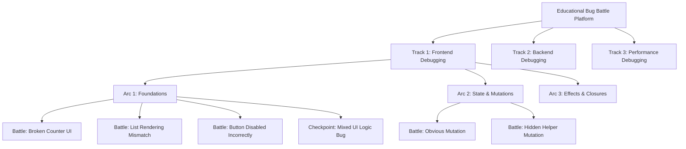
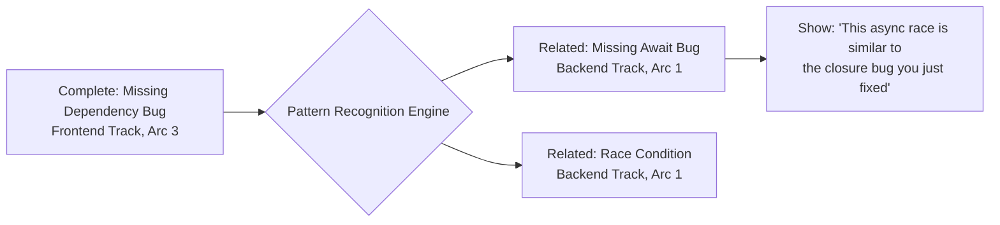

# Debugging Tracks Architecture Design

## Design Intent

This document defines a scalable, extensible curriculum architecture for the Educational Bug Battle Platform. The design ensures that:

1. Every battle belongs to a clear Track → Arc → Battle hierarchy
2. Battles are industry-relevant and teach transferable debugging intuition
3. Adding new tracks feels natural, not forced
4. Cross-track patterns are explicitly recognized and reinforced
5. The platform can scale from frontend debugging to any domain of reasoning

## Design Principles

### Educational Philosophy

| Principle                     | Rationale                                                                                              |
| ----------------------------- | ------------------------------------------------------------------------------------------------------ |
| **Observation Before Action** | Users must learn to read and understand code systematically before editing                             |
| **Progressive Complexity**    | Each arc builds on the previous, creating a learning journey                                           |
| **Transferable Intuition**    | Patterns learned in one domain apply to others (e.g., React race conditions mirror backend async bugs) |
| **Industry Relevance**        | Every bug reflects real production scenarios, not academic exercises                                   |
| **Metric-Driven Success**     | Tests validate correctness; performance tracks validate engineering maturity                           |

### Structural Philosophy

| Principle                       | Implementation                                                      |
| ------------------------------- | ------------------------------------------------------------------- |
| **Hierarchy is Permanent**      | Platform → Tracks → Arcs → Battles → Debug Traces                   |
| **Tracks are Domains**          | Not technologies (e.g., "Frontend Debugging" not "React Debugging") |
| **Arcs are Mental Models**      | Each arc teaches one core concept deeply                            |
| **Battles are Scenarios**       | Atomic, self-contained debugging exercises                          |
| **Checkpoints are Diagnostics** | Synthesis challenges with no hints that measure mastery             |

## Curriculum Architecture

### Track Hierarchy Model



### Track Metadata Structure

Each track is defined by:

| Property           | Purpose                | Example                                |
| ------------------ | ---------------------- | -------------------------------------- |
| **id**             | Unique identifier      | `frontend-debugging`                   |
| **title**          | Display name           | `Frontend Debugging`                   |
| **description**    | High-level purpose     | Master debugging UI & stateful systems |
| **primarySkill**   | Core competency taught | Debugging UI & stateful systems        |
| **executionType**  | How battles run        | `code`, `analysis`, `hybrid`           |
| **supportedTools** | Available UI tools     | `["editor", "terminal", "preview"]`    |
| **order**          | Display sequence       | `1`                                    |

### Arc Metadata Structure

Each arc is defined by:

| Property        | Purpose                | Example                                    |
| --------------- | ---------------------- | ------------------------------------------ |
| **id**          | Unique identifier      | `state-and-mutations`                      |
| **trackId**     | Parent track reference | `frontend-debugging`                       |
| **title**       | Display name           | `State & Mutations`                        |
| **description** | What the arc teaches   | Detect incorrect state updates             |
| **mentalModel** | Core concept           | State is immutable. Mutations break React. |
| **order**       | Sequence within track  | `2`                                        |

### Battle Metadata Structure

Each battle is defined by:

| Property        | Purpose                    | Example                              |
| --------------- | -------------------------- | ------------------------------------ |
| **id**          | Unique identifier          | `shopping-cart-bug`                  |
| **trackId**     | Parent track               | `frontend-debugging`                 |
| **arcId**       | Parent arc                 | `state-and-mutations`                |
| **title**       | Display name               | `Stale Cart Total`                   |
| **description** | Bug context & instructions | Markdown with acceptance criteria    |
| **difficulty**  | Cognitive load             | `Easy`, `Medium`, `Hard`             |
| **order**       | Sequence within arc        | `2`                                  |
| **tech**        | Technology stack           | `["react", "typescript", "vite"]`    |
| **files**       | Virtual filesystem         | Key-value map of filepath to content |

## Track 1: Frontend Debugging

### Track Overview

| Attribute            | Value                                                                  |
| -------------------- | ---------------------------------------------------------------------- |
| **ID**               | `frontend-debugging`                                                   |
| **Primary Skill**    | Debugging UI & stateful systems                                        |
| **Execution Type**   | `code` (WebContainer-based)                                            |
| **Supported Tools**  | Editor, Terminal, Preview                                              |
| **Learning Journey** | Surface-level observation → Deep mental models → Performance intuition |

### Arc 1: Foundations — Reading the Bug

**Mental Model:** Disciplined observation before editing. Understanding what the code does versus what it should do.

**Learning Goal:** Teach users to read code systematically and identify surface-level UI bugs through careful inspection.

#### Bug Archetypes

| Archetype                       | Description                                  | Real-World Context                               |
| ------------------------------- | -------------------------------------------- | ------------------------------------------------ |
| **Incorrect Props**             | Wrong prop type or value passed to component | Common in large codebases with weak typing       |
| **Missing Keys**                | React list items lack stable keys            | Causes rendering bugs and state loss             |
| **Wrong Conditional Rendering** | Logic error in ternary or boolean expression | Leads to invisible elements or incorrect display |

#### Battles

| Order | ID                            | Title                       | Difficulty | Bug Type          | Acceptance Criteria                               |
| ----- | ----------------------------- | --------------------------- | ---------- | ----------------- | ------------------------------------------------- |
| 1     | `broken-counter`              | Broken Counter UI           | Easy       | Incorrect props   | Counter increments by wrong value                 |
| 2     | `list-rendering-mismatch`     | List Rendering Mismatch     | Easy       | Missing keys      | List items swap incorrectly when reordered        |
| 3     | `button-disabled-incorrectly` | Button Disabled Incorrectly | Easy       | Wrong conditional | Button remains disabled when it should be enabled |

#### Checkpoint

| ID                          | Title              | Difficulty | Description                                                                                              |
| --------------------------- | ------------------ | ---------- | -------------------------------------------------------------------------------------------------------- |
| `mixed-ui-logic-checkpoint` | Mixed UI Logic Bug | Medium     | Combined props + conditional bug with no hints. Tests user's ability to systematically inspect UI logic. |

**Success Criteria:** User must identify both the prop error and the conditional logic flaw without guidance.

---

### Arc 2: State & Mutations

**Mental Model:** State is immutable. Direct mutations break React's update detection.

**Learning Goal:** Detect and fix incorrect state updates, including direct mutations and derived state mismatches.

#### Bug Archetypes

| Archetype                  | Description                                      | Real-World Context                                       |
| -------------------------- | ------------------------------------------------ | -------------------------------------------------------- |
| **Direct Mutation**        | State modified in-place instead of immutably     | Common mistake by developers from imperative backgrounds |
| **Derived State Mismatch** | State not updated when dependency changes        | Leads to stale UI and confusing user experiences         |
| **Stale UI**               | Component doesn't re-render despite state change | Often caused by mutation or shallow comparison issues    |

#### Battles

| Order | ID                       | Title                  | Difficulty | Bug Type                | Acceptance Criteria                                     |
| ----- | ------------------------ | ---------------------- | ---------- | ----------------------- | ------------------------------------------------------- |
| 1     | `obvious-mutation`       | Todo List Mutation     | Easy       | Direct mutation         | Adding todo doesn't update UI because array was mutated |
| 2     | `hidden-helper-mutation` | Hidden Helper Mutation | Medium     | Mutation in utility     | Helper function mutates state object, breaking updates  |
| 3     | `mutation-with-memo`     | Mutation + Memoization | Hard       | Mutation + optimization | `useMemo` caches stale value because state was mutated  |

**Progression Pattern:** Start with obvious in-component mutation → Move to hidden mutations in helper functions → Combine with React optimizations to show cascading effects.

---

### Arc 3: Effects & Closures

**Mental Model:** Effects capture values at render time. Dependency arrays control when effects run.

**Learning Goal:** Understand React's execution model, including when effects run and what they capture.

#### Bug Archetypes

| Archetype                | Description                                                | Real-World Context                           |
| ------------------------ | ---------------------------------------------------------- | -------------------------------------------- |
| **Missing Dependencies** | Effect uses stale values because dependencies omitted      | Most common React bug reported in production |
| **Stale Closures**       | Callback captures old value from previous render           | Causes async bugs and confusing behavior     |
| **Infinite Effects**     | Effect triggers itself, creating infinite loop             | Crashes browser or exhausts resources        |
| **Cleanup Bugs**         | Missing cleanup causes memory leaks or duplicate listeners | Hard to debug; only appears over time        |

#### Battles

| Order | ID                   | Title                   | Difficulty | Bug Type        | Acceptance Criteria                                   |
| ----- | -------------------- | ----------------------- | ---------- | --------------- | ----------------------------------------------------- |
| 1     | `missing-dependency` | Stale Counter Display   | Easy       | Missing deps    | Display shows old count because effect doesn't re-run |
| 2     | `infinite-rerender`  | Infinite Re-render Loop | Medium     | Infinite effect | Effect updates state that triggers itself             |
| 3     | `cleanup-leak`       | Event Listener Leak     | Medium     | Missing cleanup | Scroll listener duplicates on every render            |

#### Checkpoint

| ID                        | Title                    | Difficulty | Description                                                                                                  |
| ------------------------- | ------------------------ | ---------- | ------------------------------------------------------------------------------------------------------------ |
| `effect-async-checkpoint` | Effect + Async Combo Bug | Hard       | Combines missing dependency + race condition + cleanup. Tests deep understanding of React's execution model. |

---

### Arc 4: Async & Data Flow

**Mental Model:** Track data through async boundaries. Handle all states: loading, success, error.

**Learning Goal:** Build intuition for async bugs, including race conditions, stuck loading states, and swallowed errors.

#### Bug Archetypes

| Archetype           | Description                                            | Real-World Context                           |
| ------------------- | ------------------------------------------------------ | -------------------------------------------- |
| **Race Conditions** | Slow request resolves after fast one, overwriting data | Critical bug in search/autocomplete features |
| **Loading Stuck**   | Loading state never clears on error or success         | Creates unusable UI, frustrates users        |
| **Error Swallowed** | Error occurs but UI shows nothing                      | User has no feedback, appears broken         |

#### Battles

| Order | ID                       | Title                      | Difficulty | Bug Type        | Acceptance Criteria                                   |
| ----- | ------------------------ | -------------------------- | ---------- | --------------- | ----------------------------------------------------- |
| 1     | `double-fetch`           | Double Fetch Race          | Medium     | Race condition  | Fast-typing in search causes wrong results to display |
| 2     | `loading-never-ends`     | Loading Spinner Never Ends | Easy       | Loading stuck   | Spinner doesn't stop on API error                     |
| 3     | `error-boundary-missing` | Error Boundary Missing     | Medium     | Error swallowed | Component crashes but error isn't caught              |

---

### Arc 5: Performance & Renders

**Mental Model:** Understand when and why components re-render. Optimize only when necessary.

**Learning Goal:** Identify non-obvious performance bugs caused by unnecessary renders or expensive computations.

#### Bug Archetypes

| Archetype                  | Description                                     | Real-World Context                       |
| -------------------------- | ----------------------------------------------- | ---------------------------------------- |
| **Unnecessary Re-renders** | Component re-renders on unrelated state changes | Common in large apps with shared context |
| **Wrong Memoization**      | `useMemo`/`useCallback` used incorrectly        | Adds complexity without performance gain |
| **Expensive Computation**  | Heavy calculation runs on every render          | Causes UI lag and poor user experience   |

#### Battles

| Order | ID                      | Title                 | Difficulty | Bug Type            | Acceptance Criteria                                                 |
| ----- | ----------------------- | --------------------- | ---------- | ------------------- | ------------------------------------------------------------------- |
| 1     | `list-lag`              | Lagging List Scroll   | Medium     | Unnecessary renders | List re-renders all items on scroll due to inline function          |
| 2     | `usememo-misuse`        | useMemo Misuse        | Medium     | Wrong memoization   | `useMemo` has missing dependencies, returns stale value             |
| 3     | `callback-identity-bug` | Callback Identity Bug | Hard       | Callback recreation | `useEffect` runs infinitely because callback recreates every render |

---

### Final Diagnostic (Track Completion)

| ID                     | Title                      | Difficulty | Format                                               |
| ---------------------- | -------------------------- | ---------- | ---------------------------------------------------- |
| `frontend-track-final` | Frontend Debugging Mastery | Hard       | Unknown bug archetype, no hints, time-boxed (30 min) |

**Purpose:** Measure transferable intuition, not rote learning.

**Evaluation Output:**

```
Analysis Report:
- Strong intuition in: State bugs, Effect dependencies
- Weaker instincts in: Async reasoning, Race conditions
- Recommended next steps: Practice Backend Async & Concurrency Arc
```

**Success Metrics:**

- Debug trace quality (systematic vs. random)
- Time to identify root cause
- Number of incorrect edits before solution

---

## Track 2: Backend Debugging

### Track Overview

| Attribute            | Value                                                    |
| -------------------- | -------------------------------------------------------- |
| **ID**               | `backend-debugging`                                      |
| **Primary Skill**    | Debugging server logic & data flows                      |
| **Execution Type**   | `code` (Node.js in WebContainer)                         |
| **Supported Tools**  | Editor, Terminal                                         |
| **Learning Journey** | API contracts → Async concurrency → Data layer reasoning |

**Note:** Designed but not implemented yet. Ensures platform avoids frontend bias.

### Arc 1: Async & Concurrency

**Mental Model:** Reasoning about order of operations in concurrent systems.

#### Bug Archetypes

| Archetype           | Description                                         | Real-World Context                                   |
| ------------------- | --------------------------------------------------- | ---------------------------------------------------- |
| **Race Conditions** | Multiple async operations interfere with each other | Payment processed twice, inventory inconsistency     |
| **Double Writes**   | Same data written concurrently, causing overwrites  | User profile updates lost                            |
| **Missing Awaits**  | Promise not awaited, causing silent failures        | Database write doesn't complete before response sent |

#### Battles

| Order | ID                   | Title                        | Difficulty | Bug Type                      |
| ----- | -------------------- | ---------------------------- | ---------- | ----------------------------- |
| 1     | `concurrent-counter` | Concurrent Counter Increment | Easy       | Race condition in counter     |
| 2     | `double-payment`     | Double Payment Processing    | Hard       | Race condition in transaction |
| 3     | `missing-await-save` | Missing Await on Save        | Medium     | Promise not awaited           |

---

### Arc 2: API Contracts

**Mental Model:** APIs are contracts. Schema mismatches, silent failures, and status code misuse break trust.

#### Bug Archetypes

| Archetype              | Description                                   | Real-World Context                                    |
| ---------------------- | --------------------------------------------- | ----------------------------------------------------- |
| **Schema Mismatch**    | Request/response doesn't match expected shape | Frontend breaks silently, hard to debug               |
| **Silent Failures**    | Error occurs but API returns 200 OK           | User thinks operation succeeded but it failed         |
| **Status Code Misuse** | Wrong HTTP status code returned               | Breaking HTTP conventions, client handles incorrectly |

#### Battles

| Order | ID                    | Title                       | Difficulty | Bug Type                     |
| ----- | --------------------- | --------------------------- | ---------- | ---------------------------- |
| 1     | `schema-mismatch-bug` | Schema Mismatch on Login    | Easy       | API returns wrong field name |
| 2     | `silent-500`          | Silent 500 Error            | Medium     | Error caught but returns 200 |
| 3     | `wrong-status-code`   | Wrong Status Code on Delete | Easy       | Returns 200 instead of 204   |

---

### Arc 3: Data Layer Bugs

**Mental Model:** Understanding query execution patterns, indexes, and caching behavior.

#### Bug Archetypes

| Archetype         | Description                                     | Real-World Context                  |
| ----------------- | ----------------------------------------------- | ----------------------------------- |
| **N+1 Queries**   | Loop executes separate query for each item      | Kills database performance at scale |
| **Wrong Indexes** | Query scans entire table instead of using index | Slow queries as data grows          |
| **Stale Cache**   | Cache not invalidated on update                 | Users see old data after changes    |

#### Battles

| Order | ID                    | Title                         | Difficulty | Bug Type                         |
| ----- | --------------------- | ----------------------------- | ---------- | -------------------------------- |
| 1     | `n-plus-1-users`      | N+1 Query in User List        | Medium     | N+1 query fetching posts         |
| 2     | `missing-index`       | Missing Index on Search       | Medium     | Full table scan on large dataset |
| 3     | `stale-cache-profile` | Stale Cache on Profile Update | Hard       | Cache not invalidated            |

---

## Track 3: Performance Debugging

### Track Overview

| Attribute            | Value                                                           |
| -------------------- | --------------------------------------------------------------- |
| **ID**               | `performance-debugging`                                         |
| **Primary Skill**    | Performance analysis & optimization                             |
| **Execution Type**   | `code` (with profiler metrics)                                  |
| **Supported Tools**  | Editor, Terminal, Profiler                                      |
| **Learning Journey** | Identify bottlenecks → Measure impact → Optimize systematically |

**Key Differentiator:** Success is not "fix code to pass tests" but "reduce metric below threshold."

This teaches **engineering maturity** — knowing when optimization matters and how to validate it.

### Arc 1: Memory Leaks

**Mental Model:** Track object references and understand garbage collection behavior.

#### Bug Archetypes

| Archetype                       | Description                                     | Metric                               |
| ------------------------------- | ----------------------------------------------- | ------------------------------------ |
| **Event Listener Accumulation** | Listeners not removed, memory grows unbounded   | Heap size increases over time        |
| **Detached DOM Nodes**          | DOM removed but JS references keep it in memory | Detached DOM count > 100             |
| **Global Variable Pollution**   | Objects stored in global scope never released   | Heap snapshot shows retained objects |

#### Battles

| Order | ID                  | Title               | Threshold                          | Metric           |
| ----- | ------------------- | ------------------- | ---------------------------------- | ---------------- |
| 1     | `listener-leak`     | Event Listener Leak | Heap size < 10MB after 100 actions | Memory usage     |
| 2     | `detached-dom-leak` | Detached DOM Leak   | Detached DOM count < 5             | DOM nodes        |
| 3     | `global-cache-leak` | Global Cache Leak   | Heap growth < 1MB/min              | Heap growth rate |

---

### Arc 2: Render Thrashing

**Mental Model:** Minimize layout recalculations and forced synchronous layouts.

#### Bug Archetypes

| Archetype                     | Description                                       | Metric             |
| ----------------------------- | ------------------------------------------------- | ------------------ |
| **Forced Synchronous Layout** | Reading layout properties forces immediate recalc | Layout time > 16ms |
| **Excessive Repaints**        | Changing styles triggers full repaint             | Paint time > 10ms  |
| **Animation Jank**            | Animations run on main thread, blocking UI        | Frame rate < 30fps |

#### Battles

| Order | ID                      | Title                       | Threshold          | Metric               |
| ----- | ----------------------- | --------------------------- | ------------------ | -------------------- |
| 1     | `forced-layout`         | Forced Layout in Loop       | Layout time < 5ms  | Layout performance   |
| 2     | `repaint-on-scroll`     | Excessive Repaint on Scroll | Paint time < 3ms   | Paint performance    |
| 3     | `main-thread-animation` | Main Thread Animation Jank  | Frame rate > 55fps | Animation smoothness |

---

### Arc 3: Inefficient Algorithms

**Mental Model:** Recognize algorithmic complexity issues in real-world code.

#### Bug Archetypes

| Archetype                      | Description                              | Metric                      |
| ------------------------------ | ---------------------------------------- | --------------------------- |
| **Nested Loops**               | O(n²) algorithm where O(n) exists        | Execution time with n=10000 |
| **Redundant Computations**     | Same calculation repeated unnecessarily  | Function call count         |
| **Inefficient Data Structure** | Using array where Set/Map is appropriate | Lookup time                 |

#### Battles

| Order | ID                   | Title                       | Threshold                     | Metric              |
| ----- | -------------------- | --------------------------- | ----------------------------- | ------------------- |
| 1     | `nested-loop-search` | Nested Loop in Search       | Execution time < 50ms (n=10k) | Runtime performance |
| 2     | `redundant-sort`     | Redundant Sort in Render    | Function calls < 100          | Call frequency      |
| 3     | `array-lookup`       | Array Lookup Instead of Set | Lookup time < 1ms (n=10k)     | Lookup performance  |

---

## Cross-Track Design Patterns

### Purpose

Cross-track references build **transferable intuition** — the platform's biggest competitive moat. Users recognize patterns across domains.

### Pattern Recognition System

When a user completes a battle, the platform analyzes their debug trace and surfaces related patterns from other tracks.



### Cross-Track Pattern Map

| Frontend Pattern                  | Backend Equivalent                    | Shared Concept         |
| --------------------------------- | ------------------------------------- | ---------------------- |
| Missing dependency in `useEffect` | Missing `await` in async function     | Async timing bugs      |
| Race condition in double fetch    | Race condition in concurrent writes   | Order of operations    |
| Mutation breaks React updates     | Stale cache not invalidated           | State synchronization  |
| N+1 re-renders                    | N+1 database queries                  | Loop inefficiency      |
| Memory leak from event listeners  | Memory leak from unclosed connections | Resource cleanup       |
| Expensive computation in render   | Expensive query without index         | Performance bottleneck |

### Pattern Reinforcement Mechanism

When a user encounters a pattern they've seen before:

1. **Contextual Hint:** "You've seen this pattern before in [Track Name, Arc Name]"
2. **Reflection Prompt:** "How is this similar to the [Previous Bug] bug?"
3. **Debug Trace Comparison:** Show side-by-side comparison of their reasoning process

**Example:**

```
You encountered a race condition in Frontend Arc 4: Async & Data Flow.

Now you're seeing a similar pattern in Backend Arc 1: Async & Concurrency.

Your Approach in Frontend:
1. Identified fast-typing causing overlapping requests
2. Used abort controller to cancel previous requests
3. Ensured latest request always wins

How might this apply here?
```

---

## Scalability Architecture

### Adding a New Track: Step-by-Step

The platform is designed so adding a new track feels **obvious, not scary**.

#### 1. Define Track Metadata

Create entry in `/lib/content/tracks.ts`:

```
{
  id: "mobile-debugging",
  title: "Mobile Debugging",
  description: "Debug native and cross-platform mobile applications",
  primarySkill: "Debugging mobile UX & platform-specific issues",
  executionType: "code",
  supportedTools: ["editor", "terminal", "device-preview"],
  order: 8
}
```

#### 2. Define Arcs for Track

Create arcs in `/lib/content/arcs.ts`:

```
{
  id: "touch-gesture-bugs",
  trackId: "mobile-debugging",
  title: "Touch & Gesture Bugs",
  description: "Debug touch handling, gestures, and mobile interactions",
  mentalModel: "Mobile input is event-driven and state-dependent",
  order: 1
}
```

#### 3. Create Battles

Create battle files in `/lib/content/challenges/`:

```
{
  id: "swipe-not-triggering",
  trackId: "mobile-debugging",
  arcId: "touch-gesture-bugs",
  title: "Swipe Gesture Not Triggering",
  description: "...",
  difficulty: "Medium",
  order: 1,
  tech: ["react-native", "typescript"],
  files: { ... }
}
```

#### 4. Register Battles

Add to battle registry in `/lib/content/registry.ts`:

```
{
  id: "swipe-not-triggering",
  trackId: "mobile-debugging",
  arcId: "touch-gesture-bugs",
  order: 1,
  loader: () => import("./challenges/swipe-gesture").then(m => m.swipeGestureBattle)
}
```

#### 5. Define Cross-Track Patterns (Optional)

Map patterns to existing tracks:

| Mobile Pattern         | Frontend Equivalent         |
| ---------------------- | --------------------------- |
| Touch event not firing | Click event missing handler |
| Gesture conflict       | Event propagation bug       |

**Result:** Track appears automatically in platform UI, maintains hierarchy, supports navigation.

---

### Extension Points

The architecture provides extension points for future capabilities:

| Extension                    | Implementation                                                        |
| ---------------------------- | --------------------------------------------------------------------- |
| **AI-Generated Battles**     | Accept battle metadata from AI, validate schema, inject into registry |
| **User-Created Tracks**      | Allow users to define custom tracks with same schema                  |
| **Adaptive Difficulty**      | Adjust battle order based on user performance metrics                 |
| **Cross-Platform Execution** | Add `executionType: "native"` for non-WebContainer environments       |
| **Collaborative Debugging**  | Multi-user battles with shared debug traces                           |

---

## Battle Design Guidelines

### Industry Relevance Checklist

Every battle must pass this checklist:

| Criterion                     | Question                                                  | Example                                        |
| ----------------------------- | --------------------------------------------------------- | ---------------------------------------------- |
| **Real Production Scenario**  | Has this bug appeared in real codebases?                  | Yes - missing `await` is extremely common      |
| **Non-Trivial to Spot**       | Would an experienced developer miss this on first glance? | Yes - mutation in helper function is subtle    |
| **Teachable Moment**          | Does fixing this build transferable intuition?            | Yes - teaches immutability principle           |
| **Clear Acceptance Criteria** | Can success be objectively measured?                      | Yes - test passes when total updates correctly |

### Anti-Patterns to Avoid

| Anti-Pattern               | Why Bad                             | Example                                    |
| -------------------------- | ----------------------------------- | ------------------------------------------ |
| **Artificial Complexity**  | Doesn't reflect real code           | `var x = 1; x = x + 1 - 1 + 1;`            |
| **Syntax Errors**          | Not debugging, just typos           | Missing semicolon                          |
| **Deprecated APIs**        | Not relevant to modern development  | Using `var` instead of `let`               |
| **Domain-Specific Jargon** | Requires non-transferable knowledge | Bug only makes sense in specific framework |

### Battle Difficulty Calibration

| Difficulty | Time to Solve | Cognitive Load                    | Example                          |
| ---------- | ------------- | --------------------------------- | -------------------------------- |
| **Easy**   | 5-10 min      | Single concept                    | Missing dependency in effect     |
| **Medium** | 15-25 min     | Two combined concepts             | Mutation + memoization           |
| **Hard**   | 30-45 min     | Three+ concepts or deep reasoning | Race condition + cleanup + async |

---

## Success Metrics

### User Progress Metrics

| Metric                            | Purpose                         | Threshold                           |
| --------------------------------- | ------------------------------- | ----------------------------------- |
| **Time to First Edit**            | Measures observation discipline | < 2 min = good (read before acting) |
| **Incorrect Edits**               | Measures hypothesis quality     | < 3 = strong intuition              |
| **Debug Trace Depth**             | Measures systematic thinking    | > 5 entries = thorough              |
| **Cross-Arc Pattern Recognition** | Measures transferable learning  | > 60% = strong                      |

### Track Completion Metrics

| Metric                  | Purpose                                                  |
| ----------------------- | -------------------------------------------------------- |
| **Arc Mastery Score**   | Percentage of battles passed on first attempt            |
| **Debug Trace Quality** | AI analysis of reasoning process (systematic vs. random) |
| **Time Efficiency**     | Average time per battle vs. expected time                |
| **Pattern Application** | Number of times user applied pattern from different arc  |

### Platform Health Metrics

| Metric                     | Target | Indicates                            |
| -------------------------- | ------ | ------------------------------------ |
| **Battle Completion Rate** | > 70%  | Difficulty well-calibrated           |
| **Arc Dropout Rate**       | < 30%  | Learning curve not too steep         |
| **Cross-Track Engagement** | > 40%  | Users find value in multiple domains |
| **Debug Trace Submitted**  | > 80%  | Users engage with learning process   |

---

## Implementation Roadmap

### Phase 1: Frontend Track Completion (Current)

**Status:** In Progress

**Deliverables:**

- Complete all 5 arcs with 3-4 battles each
- Implement checkpoints for Arcs 1, 3
- Build final diagnostic battle
- Add cross-arc pattern hints

**Timeline:** 4-6 weeks

---

### Phase 2: Backend Track Foundation

**Status:** Designed, Not Implemented

**Deliverables:**

- Implement Arc 1: Async & Concurrency (3 battles)
- Implement Arc 2: API Contracts (3 battles)
- Add Node.js execution support in WebContainer
- Build cross-track pattern recognition for Frontend ↔ Backend

**Timeline:** 3-4 weeks

---

### Phase 3: Performance Track

**Status:** Designed, Not Implemented

**Deliverables:**

- Implement metric-based validation system
- Build profiler integration (memory, CPU, frame rate)
- Implement Arc 1: Memory Leaks (3 battles)
- Create performance diagnostic dashboard

**Timeline:** 4-5 weeks

---

### Phase 4: Cross-Track Intelligence

**Status:** Design Phase

**Deliverables:**

- Build pattern recognition engine
- Implement debug trace comparison UI
- Add adaptive battle recommendations
- Create track completion diagnostic report

**Timeline:** 3-4 weeks

---

## Confidence Assessment

**Confidence Level:** High

**Confidence Basis:**

| Factor                   | Assessment                                                |
| ------------------------ | --------------------------------------------------------- |
| **Architecture Clarity** | Hierarchy is well-defined and proven in existing codebase |
| **Scalability**          | Adding new tracks requires no architectural changes       |
| **Industry Relevance**   | All bug archetypes reflect real production scenarios      |
| **Implementation Path**  | Clear separation between design and implementation phases |
| **Risk Level**           | Low - extends existing proven patterns                    |

**Potential Risks:**

| Risk                                     | Mitigation                                                        |
| ---------------------------------------- | ----------------------------------------------------------------- |
| Battle difficulty calibration            | User testing + analytics, iterate on timing thresholds            |
| Cross-track pattern recognition accuracy | Start with manual curation, build AI confidence over time         |
| Performance track metric collection      | Use established profiling APIs, validate against known benchmarks |
