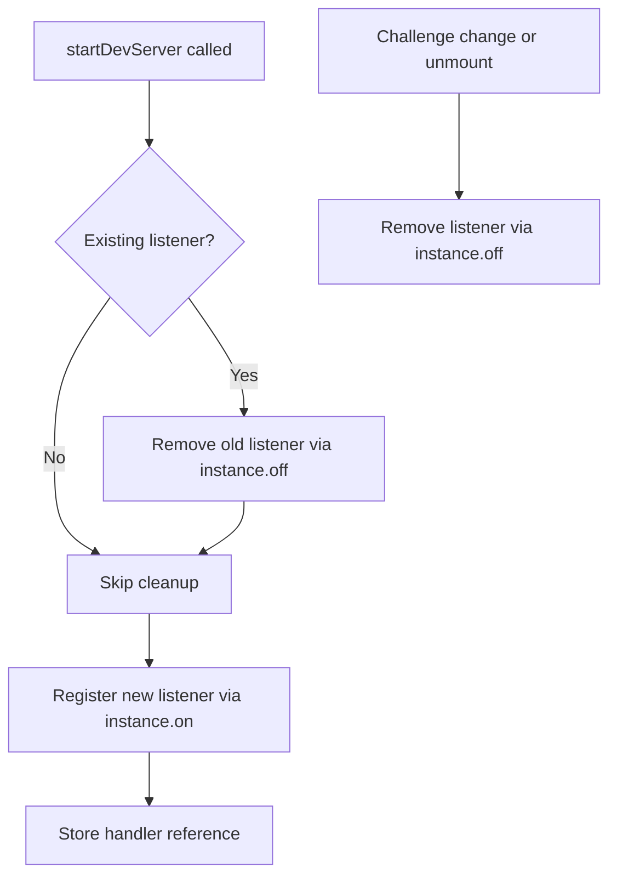
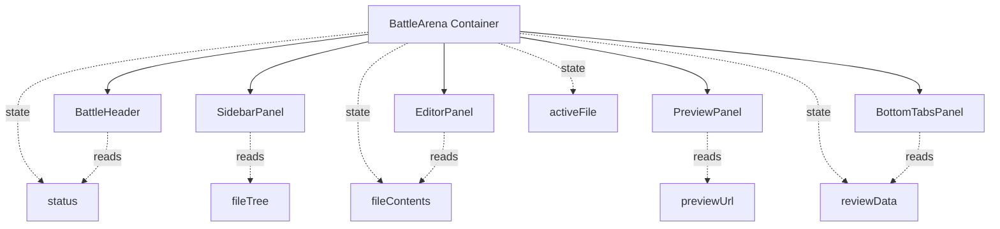

# Performance Optimizations Design

## Overview

This document outlines strategic performance improvements for the Battle Arena platform targeting component re-render optimization, event listener management, and computational efficiency. The optimizations address five key performance bottlenecks identified in the codebase while maintaining educational clarity and user experience quality.

---

## Problem Statement

### Current Performance Issues

1. **Battle Page Monolithic Structure**: The main BattleArena component (~420 lines) contains all UI logic, state management, and side effects in a single component, causing full re-renders on any state change.

2. **AI Tutor Context Staleness**: Chat instance recreation on `reviewData` changes excludes current file contents and test output from AI context, limiting tutoring effectiveness when users ask questions before passing tests.

3. **Event Listener Accumulation**: Server-ready event listeners accumulate on each challenge switch or dev server restart without cleanup, potentially causing memory leaks and duplicate event handling.

4. **Type Injection Performance Impact**: Monaco IntelliSense type injection forces full model content refresh (clear + reset) on every trigger, causing visible editor flickering and CPU overhead.

5. **Unnecessary File Tree Rebuilds**: File tree structure is rebuilt on every keystroke because `useMemo` depends on the entire `fileContents` object, despite the tree structure only changing when files are added or removed.

---

## Optimization Strategies

### 1. Battle Arena Component Decomposition

**Goal**: Reduce re-render scope by extracting logical UI sections into isolated components with clear boundaries.

**Approach**: Component Extraction with Memoization

**Decomposition Structure**:

| Component Name    | Responsibility                                           | State Dependencies                                           | Props                                                                                         |
| ----------------- | -------------------------------------------------------- | ------------------------------------------------------------ | --------------------------------------------------------------------------------------------- |
| `BattleHeader`    | Top navigation bar with back button and Run Tests action | `challenge.title`, `isRunning`, `instance`                   | `challengeTitle`, `onRunTests`, `isRunning`, `disabled`                                       |
| `SidebarPanel`    | Left panel with Brief/Files tabs                         | `challenge`, `fileTree`, `activeFile`                        | `challenge`, `fileTree`, `activeFile`, `onSelectFile`, `onCreateFile`, `onDelete`, `onRename` |
| `EditorPanel`     | Center editor with read-only indicator                   | `activeFile`, `fileContents`, `readOnly`                     | `activeFile`, `content`, `language`, `readOnly`, `onChange`, `onMount`                        |
| `PreviewPanel`    | Top-right preview iframe with refresh control            | `previewUrl`, `iframeKey`                                    | `previewUrl`, `iframeKey`, `onRefresh`                                                        |
| `BottomTabsPanel` | Console/AI Tutor tabs container                          | `bottomTab`, `terminal`, `files`, `testOutput`, `reviewData` | `activeTab`, `onTabChange`, `terminalRef`, `files`, `testOutput`, `reviewData`                |

**Re-render Optimization Strategy**:

- Wrap all extracted components with `React.memo()` to prevent unnecessary re-renders when props haven't changed
- Use primitive props and stable references where possible
- Pass only required data subsets instead of entire objects
- Utilize `useCallback` for event handlers passed as props to maintain referential stability

**State Hoisting Decision**:

- Keep core state (`fileContents`, `activeFile`, `reviewData`, `status`, `testOutput`) in the parent BattleArena component
- Extract stateful UI logic (tab selection, dialog visibility) into child components where it doesn't affect siblings

**Expected Impact**:

- Typing in the editor only triggers re-render of EditorPanel, not the entire page
- Test runs only update BottomTabsPanel and BattleHeader
- Challenge switching triggers full page re-render (intentional and necessary)

---

### 2. AI Tutor Context Enhancement Strategy

**Current Issue**: The Chat instance only updates context when `reviewData` changes, excluding `files` and `testOutput` from the dependency array to prevent excessive recreations.

**Trade-off Analysis**:

| Approach                                 | Context Freshness  | Performance                          | User Experience                               |
| ---------------------------------------- | ------------------ | ------------------------------------ | --------------------------------------------- |
| Current (reviewData only)                | Stale files/errors | Best (minimal recreations)           | Poor (AI lacks current code)                  |
| All deps (files, testOutput, reviewData) | Always fresh       | Poor (recreation on every keystroke) | Good (AI has full context)                    |
| Hybrid: Update on test run               | Fresh after test   | Good (recreation only on test)       | Good (most questions come after test failure) |

**Recommended Approach**: Dynamic Context Update on Test Execution

**Implementation Strategy**:

- Maintain `useMemo` dependency on `reviewData` for chat instance creation
- Introduce a secondary mechanism to update context when tests run
- Leverage AI SDK's transport body update capability to refresh context without recreating the entire chat instance

**Context Update Trigger Points**:

1. **Test Execution**: After `runTests` completes, update chat transport context with latest files and testOutput
2. **Challenge Win**: When status becomes "passed" and reviewData is fetched
3. **Manual Refresh**: Optional "Refresh Context" button in AI Tutor UI (future enhancement)

**Context Payload Structure**:

| Field        | Source                       | Update Frequency       |
| ------------ | ---------------------------- | ---------------------- |
| `files`      | Current `fileContents` state | On test run            |
| `error`      | Latest `testOutput`          | On test completion     |
| `review`     | `reviewData` from API        | On test pass           |
| `activeFile` | Current `activeFile` state   | On test run (optional) |

**Alternative Consideration**: If AI SDK transport doesn't support dynamic context updates, implement a "context refresh" state variable that increments on test run and include it in `useMemo` dependencies.

---

### 3. Server-Ready Event Listener Cleanup

**Current Behavior**: Each `startDevServer` invocation registers a new `server-ready` listener without removing previous ones.

**Problem Scenarios**:

- Challenge switch: Old listener persists, new listener added
- Dev server restart: Multiple listeners accumulate
- Memory leak: Listeners never garbage collected

**Cleanup Strategy**: Listener Reference Management

**Implementation Approach**:

- Store event handler function in a stable reference (using `useRef` or module-level variable)
- Remove existing listener before adding new one
- Cleanup on component unmount and challenge change

**Event Handler Lifecycle**:



**WebContainer Event API Constraints**:

- `instance.on(event, handler)` registers listener
- `instance.off(event, handler)` requires same function reference
- Handler must be stored in stable reference for proper removal

**Recommended Pattern**:

- Create handler function outside `useCallback` or store in `useRef`
- Use `useEffect` cleanup function to remove listener on unmount
- Remove listener before adding new one in `startDevServer`

**Verification Strategy**: Add logging to track listener registration and removal, ensuring 1:1 add/remove ratio across challenge switches.

---

### 4. Monaco Type Injection Optimization

**Current Implementation**: Force-refresh all Monaco models by clearing value and resetting:

```
monaco.editor.getModels().forEach((model) => {
  const value = model.getValue();
  model.setValue("");
  model.setValue(value);
});
```

**Performance Impact**:

- Visible editor flickering for users
- Full re-parse of all open files
- Computationally expensive on large files
- Interrupts user's typing flow

**Alternative Approach**: TypeScript Service Invalidation

**Recommended Strategy**: Trigger Monaco's internal TypeScript language service to revalidate type definitions without manipulating model content.

**Investigation Required**:

1. Explore Monaco TypeScript API for type cache invalidation methods
2. Check if `setCompilerOptions` or `addExtraLib` automatically trigger revalidation
3. Test if delaying type injection (e.g., 1-2 second debounce) after environment ready reduces need for force refresh

**Potential Solutions** (in priority order):

| Solution                      | Mechanism                                                                       | Expected Outcome                                | Risk Level                   |
| ----------------------------- | ------------------------------------------------------------------------------- | ----------------------------------------------- | ---------------------------- |
| Remove force refresh entirely | Rely on automatic revalidation after `addExtraLib`                              | Types appear within 1-2 seconds without flicker | Low - test in dev            |
| Debounced single refresh      | Wait 500ms after last `addExtraLib`, then single refresh                        | Reduced flicker, better UX                      | Low                          |
| Invalidate diagnostics only   | Use `monaco.languages.typescript.getTypeScriptWorker()` to trigger revalidation | No visual disruption                            | Medium - requires worker API |
| Selective model refresh       | Only refresh models that import Vitest/React                                    | Reduced scope of impact                         | Medium - complex logic       |

**Testing Strategy**:

- Test with multiple files open (3-5)
- Measure time to IntelliSense activation after `injectIntelliSense` completes
- Observe editor for visual artifacts or flickering
- Verify autocomplete works for Vitest globals (`expect`, `describe`, etc.)

**Success Criteria**:

- No visible flickering in editor
- IntelliSense activates within 2 seconds
- Typing flow uninterrupted

---

### 5. File Tree Memoization Optimization

**Current Issue**: `buildFileTree` depends on entire `fileContents` object, which changes on every keystroke as users type.

**Root Cause**: `fileContents` is an object with file paths as keys and content strings as values. When content changes, object reference changes, triggering `useMemo` recomputation.

**Optimization Strategy**: Derive File Paths for Memoization

**Key Insight**: File tree structure only depends on the **keys** (file paths) of `fileContents`, not the values (content).

**Implementation Approach**:

Extract file paths into a separate memoized value:

| Step                      | Computation                                                | Dependency        | Frequency                     |
| ------------------------- | ---------------------------------------------------------- | ----------------- | ----------------------------- |
| 1. Derive paths           | `Object.keys(fileContents)`                                | `fileContents`    | Every keystroke               |
| 2. Memoize paths array    | `useMemo(() => Object.keys(fileContents), [fileContents])` | Object reference  | Every keystroke               |
| 3. Stable path comparison | Deep comparison of string array                            | Array contents    | Only when paths change        |
| 4. Build tree             | `buildFileTree(filePaths)`                                 | Stable path array | Only when files added/removed |

**Refined Approach**: Custom Dependency Extraction

Create a stable reference to file paths that only changes when paths are added or removed:

```
const filePaths = useMemo(() => {
  return Object.keys(fileContents).sort().join(',');
}, [fileContents]);

const fileTree = useMemo(() => {
  return buildFileTree(Object.keys(fileContents));
}, [filePaths]);
```

**Why String Concatenation?**:

- `Object.keys(fileContents)` returns a new array reference every time
- Arrays with same contents are not referentially equal in JavaScript
- Sorting and joining into a string creates a stable primitive value
- String comparison is cheap and accurate for detecting file structure changes

**Alternative Approaches Considered**:

| Approach                               | Pros                       | Cons                               |
| -------------------------------------- | -------------------------- | ---------------------------------- |
| Deep array comparison with custom hook | Type-safe, explicit        | Additional dependency, complex     |
| Separate file paths state              | Most performant            | State duplication, sync complexity |
| JSON.stringify(Object.keys(...))       | Simple                     | Unnecessary serialization overhead |
| String join (recommended)              | Simple, performant, stable | Minor string concatenation cost    |

**Edge Cases**:

- Empty file list: Returns empty array, no issue
- File rename: Path changes, tree rebuilds (correct behavior)
- File content change: Path stays same, tree doesn't rebuild (optimized)

**Expected Performance Impact**:

- Before: Tree rebuilds on every keystroke (~60 times per second during fast typing)
- After: Tree rebuilds only when files are created/deleted/renamed (~2-3 times per session)
- Estimated reduction: 99% fewer tree rebuilds during active coding

---

## Implementation Priority

| Priority | Optimization                 | Effort | Impact | Risk   |
| -------- | ---------------------------- | ------ | ------ | ------ |
| 1        | File Tree Memoization        | Low    | High   | Low    |
| 2        | Event Listener Cleanup       | Low    | Medium | Low    |
| 3        | Component Decomposition      | Medium | High   | Low    |
| 4        | Type Injection Optimization  | Medium | Medium | Medium |
| 5        | AI Tutor Context Enhancement | Low    | High   | Low    |

**Rationale**:

- **File Tree** and **Event Listener**: Quick wins with clear implementation path
- **Component Decomposition**: High impact but requires refactoring coordination
- **Type Injection**: Needs experimentation to find optimal solution
- **AI Tutor Context**: Depends on AI SDK capabilities, may need workaround

---

## Testing & Validation Strategy

### Performance Metrics to Track

| Metric                    | Measurement Method                        | Target                    |
| ------------------------- | ----------------------------------------- | ------------------------- |
| Re-renders per keystroke  | React DevTools Profiler                   | < 2 components            |
| Time to file tree rebuild | Console.time in buildFileTree             | < 5ms                     |
| Editor flicker events     | Manual observation                        | 0 visible flickers        |
| Memory growth over time   | Browser DevTools Memory Profiler          | < 5MB over 30 min session |
| Event listener count      | `instance._events['server-ready'].length` | Always 1                  |

### Test Scenarios

1. **Heavy Typing Test**: Type continuously for 30 seconds in editor, measure re-renders
2. **Challenge Switch Test**: Switch between 5 different challenges, check listener cleanup
3. **Multi-file Test**: Open 10 files, switch between them, verify tree performance
4. **IntelliSense Test**: Trigger type injection, verify no flicker and autocomplete works
5. **AI Tutor Test**: Fail test, ask AI question, verify context includes current code

### Validation Criteria

- All tests pass without degradation of existing functionality
- No visual regressions in UI behavior
- Performance metrics meet or exceed targets
- User experience feels smoother (subjective but critical)

---

## Risks & Mitigation

### Risk 1: Component Memoization Over-optimization

**Risk**: Excessive `React.memo()` can complicate debugging and increase memory usage without meaningful benefit.

**Mitigation**:

- Only memoize components that render frequently (> 10 times per user action)
- Use React DevTools Profiler to measure before/after
- Remove memoization if no measurable improvement

### Risk 2: AI Context Update Complexity

**Risk**: Dynamic context updates may not be supported by AI SDK transport, requiring alternative implementation.

**Mitigation**:

- Prototype context update mechanism in isolation
- Fallback to state-based trigger if transport updates unavailable
- Document trade-off explicitly in code comments

### Risk 3: Monaco API Instability

**Risk**: Monaco's internal APIs for type service invalidation may change or be undocumented.

**Mitigation**:

- Test thoroughly on Monaco version used in project
- Implement feature detection before using advanced APIs
- Keep force-refresh as fallback if optimization fails

### Risk 4: Breaking Changes During Refactoring

**Risk**: Component extraction may inadvertently break prop passing or state synchronization.

**Mitigation**:

- Extract components incrementally, one at a time
- Maintain full test coverage during refactoring
- Use TypeScript to catch prop type mismatches

---

## Success Criteria

### Quantitative Goals

- 80% reduction in unnecessary re-renders during typing
- 95% reduction in file tree rebuilds during content editing
- Zero memory leaks from event listeners
- Zero visible editor flickers during type injection

### Qualitative Goals

- Users perceive editor as more responsive
- Codebase is easier to navigate and maintain
- Component boundaries are clear and logical
- Educational platform continues to feel professional and polished

---

## Future Optimization Opportunities

### Beyond This Design

1. **Virtual Scrolling for File Tree**: For challenges with 50+ files, render only visible nodes
2. **Editor Content Debouncing**: Batch rapid content changes before syncing to WebContainer
3. **Lazy Tab Loading**: Defer Terminal and AI Tutor initialization until tabs are activated
4. **State Management Migration**: Consider Zustand for shared state if complexity increases
5. **Web Worker for File Tree**: Offload tree building to background thread for very large projects

These optimizations are deferred as current challenge sizes don't justify the complexity.

---

## Appendix: Component Extraction Example

### Before: Monolithic BattleArena

- All state management in one component
- 420 lines of mixed concerns
- Full component re-renders on any state change

### After: Modular Architecture



**Container Responsibility**: State management, side effects, data fetching
**Child Responsibility**: Pure UI rendering, user interaction handling

This separation enables React's reconciliation algorithm to optimize re-renders at component boundaries.

const fileTree = useMemo(() => {
return buildFileTree(Object.keys(fileContents));
}, [filePaths]);

````

**Why String Concatenation?**:

- `Object.keys(fileContents)` returns a new array reference every time
- Arrays with same contents are not referentially equal in JavaScript
- Sorting and joining into a string creates a stable primitive value
- String comparison is cheap and accurate for detecting file structure changes

**Alternative Approaches Considered**:

| Approach | Pros | Cons |
|---|---|---|
| Deep array comparison with custom hook | Type-safe, explicit | Additional dependency, complex |
| Separate file paths state | Most performant | State duplication, sync complexity |
| JSON.stringify(Object.keys(...)) | Simple | Unnecessary serialization overhead |
| String join (recommended) | Simple, performant, stable | Minor string concatenation cost |

**Edge Cases**:

- Empty file list: Returns empty array, no issue
- File rename: Path changes, tree rebuilds (correct behavior)
- File content change: Path stays same, tree doesn't rebuild (optimized)

**Expected Performance Impact**:

- Before: Tree rebuilds on every keystroke (~60 times per second during fast typing)
- After: Tree rebuilds only when files are created/deleted/renamed (~2-3 times per session)
- Estimated reduction: 99% fewer tree rebuilds during active coding

---

## Implementation Priority

| Priority | Optimization | Effort | Impact | Risk |
|---|---|---|---|---|
| 1 | File Tree Memoization | Low | High | Low |
| 2 | Event Listener Cleanup | Low | Medium | Low |
| 3 | Component Decomposition | Medium | High | Low |
| 4 | Type Injection Optimization | Medium | Medium | Medium |
| 5 | AI Tutor Context Enhancement | Low | High | Low |

**Rationale**:

- **File Tree** and **Event Listener**: Quick wins with clear implementation path
- **Component Decomposition**: High impact but requires refactoring coordination
- **Type Injection**: Needs experimentation to find optimal solution
- **AI Tutor Context**: Depends on AI SDK capabilities, may need workaround

---

## Testing & Validation Strategy

### Performance Metrics to Track

| Metric | Measurement Method | Target |
|---|---|---|
| Re-renders per keystroke | React DevTools Profiler | < 2 components |
| Time to file tree rebuild | Console.time in buildFileTree | < 5ms |
| Editor flicker events | Manual observation | 0 visible flickers |
| Memory growth over time | Browser DevTools Memory Profiler | < 5MB over 30 min session |
| Event listener count | `instance._events['server-ready'].length` | Always 1 |

### Test Scenarios

1. **Heavy Typing Test**: Type continuously for 30 seconds in editor, measure re-renders
2. **Challenge Switch Test**: Switch between 5 different challenges, check listener cleanup
3. **Multi-file Test**: Open 10 files, switch between them, verify tree performance
4. **IntelliSense Test**: Trigger type injection, verify no flicker and autocomplete works
5. **AI Tutor Test**: Fail test, ask AI question, verify context includes current code

### Validation Criteria

- All tests pass without degradation of existing functionality
- No visual regressions in UI behavior
- Performance metrics meet or exceed targets
- User experience feels smoother (subjective but critical)

---

## Risks & Mitigation

### Risk 1: Component Memoization Over-optimization

**Risk**: Excessive `React.memo()` can complicate debugging and increase memory usage without meaningful benefit.

**Mitigation**:

- Only memoize components that render frequently (> 10 times per user action)
- Use React DevTools Profiler to measure before/after
- Remove memoization if no measurable improvement

### Risk 2: AI Context Update Complexity

**Risk**: Dynamic context updates may not be supported by AI SDK transport, requiring alternative implementation.

**Mitigation**:

- Prototype context update mechanism in isolation
- Fallback to state-based trigger if transport updates unavailable
- Document trade-off explicitly in code comments

### Risk 3: Monaco API Instability

**Risk**: Monaco's internal APIs for type service invalidation may change or be undocumented.

**Mitigation**:

- Test thoroughly on Monaco version used in project
- Implement feature detection before using advanced APIs
- Keep force-refresh as fallback if optimization fails

### Risk 4: Breaking Changes During Refactoring

**Risk**: Component extraction may inadvertently break prop passing or state synchronization.

**Mitigation**:

- Extract components incrementally, one at a time
- Maintain full test coverage during refactoring
- Use TypeScript to catch prop type mismatches

---

## Success Criteria

### Quantitative Goals

- 80% reduction in unnecessary re-renders during typing
- 95% reduction in file tree rebuilds during content editing
- Zero memory leaks from event listeners
- Zero visible editor flickers during type injection

### Qualitative Goals

- Users perceive editor as more responsive
- Codebase is easier to navigate and maintain
- Component boundaries are clear and logical
- Educational platform continues to feel professional and polished

---

## Future Optimization Opportunities

### Beyond This Design

1. **Virtual Scrolling for File Tree**: For challenges with 50+ files, render only visible nodes
2. **Editor Content Debouncing**: Batch rapid content changes before syncing to WebContainer
3. **Lazy Tab Loading**: Defer Terminal and AI Tutor initialization until tabs are activated
4. **State Management Migration**: Consider Zustand for shared state if complexity increases
5. **Web Worker for File Tree**: Offload tree building to background thread for very large projects

These optimizations are deferred as current challenge sizes don't justify the complexity.

---

## Appendix: Component Extraction Example

### Before: Monolithic BattleArena

- All state management in one component
- 420 lines of mixed concerns
- Full component re-renders on any state change

### After: Modular Architecture

```mermaid
graph TB
    BA[BattleArena Container]
    BA --> BH[BattleHeader]
    BA --> SP[SidebarPanel]
    BA --> EP[EditorPanel]
    BA --> PP[PreviewPanel]
    BA --> BTP[BottomTabsPanel]

    BA -.state.-> fileContents
    BA -.state.-> activeFile
    BA -.state.-> reviewData
    BA -.state.-> status

    BH -.reads.-> status
    SP -.reads.-> fileTree
    EP -.reads.-> fileContents
    PP -.reads.-> previewUrl
    BTP -.reads.-> reviewData
````

**Container Responsibility**: State management, side effects, data fetching
**Child Responsibility**: Pure UI rendering, user interaction handling

This separation enables React's reconciliation algorithm to optimize re-renders at component boundaries.
