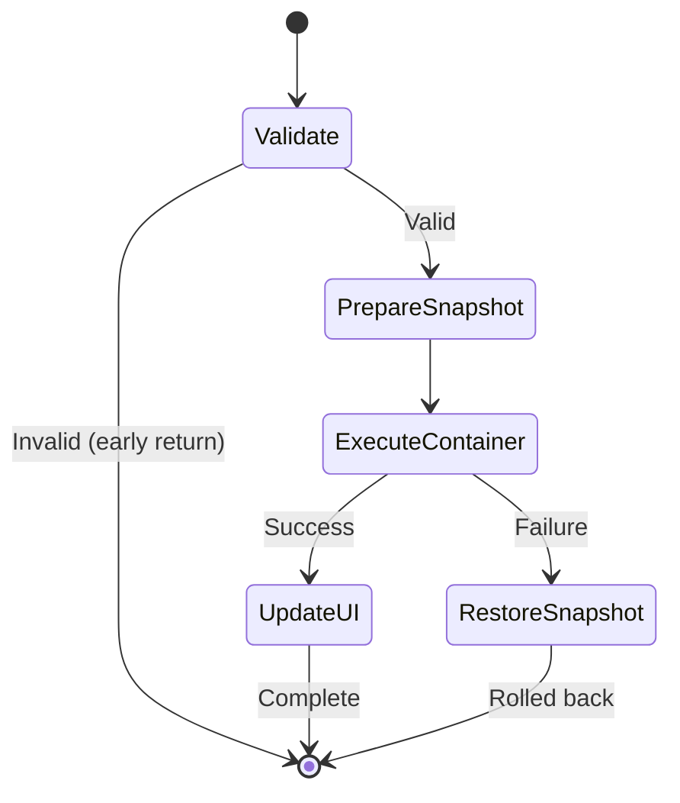

# React Strict Mode Resilience & Architecture Improvements

## Overview

This design addresses three architectural improvements to enhance the robustness and maintainability of the Battle Arena platform:

1. **React Strict Mode Resilience**: Ensure all hooks and effects properly handle double-invocation during development
2. **Context-Based State Management**: Replace prop drilling with React Context for battle-related state and actions
3. **Filesystem Rollback Mechanisms**: Implement transaction-like behavior for file operations with automatic rollback on failure

## Problem Analysis

### Current State

The application currently exhibits the following characteristics:

**Strict Mode Handling**:

- `useWebContainer` has guards (`bootStarted` flag) to prevent duplicate initialization
- `useDevServer` uses `hasServerListenerRef` to prevent duplicate event listener registration
- Other hooks may lack similar protections against double-invocation

**State Management**:

- Battle state flows through props from `page.tsx` to child components (SidebarPanel, BattleHeader, etc.)
- File operation callbacks are passed down multiple component layers
- Adding new features requiring shared state involves modifying multiple component prop interfaces

**File Operations**:

- `useFileSystem.createFile` implements rollback (deletes from store if container write fails)
- `useFileSystem.deletePath` updates UI first, then attempts container deletion without rollback
- `useFileSystem.renamePath` updates container first, then updates store only if successful (partial rollback)
- Inconsistent error handling across different operation types

### Risks & Constraints

**Risks**:

- React Strict Mode double-invocation can cause duplicate WebContainer boots, server processes, or event listeners
- Prop drilling makes the component tree brittle and difficult to extend
- File operation failures can leave UI state inconsistent with actual filesystem state

**Constraints**:

- WebContainer operations are asynchronous and can fail
- React Strict Mode is non-negotiable for development (best practice)
- Must maintain existing Zustand stores for their current responsibilities
- Cannot introduce backend database (localStorage/client-side only)

## Design Goals

1. **Resilience**: All hooks should be safe in React Strict Mode without side effects
2. **Simplicity**: Reduce prop drilling by centralizing battle-related state access
3. **Consistency**: Ensure UI state always reflects actual filesystem state
4. **Maintainability**: Make it easy to add new features without touching multiple component layers

## Proposed Architecture

### 1. React Strict Mode Resilience Strategy

#### Principle: Idempotency by Design

All hooks that perform side effects must implement one of the following patterns:

**Pattern A: Boolean Guard (for single-use operations)**

```
const guardRef = useRef(false);

useEffect(() => {
  if (guardRef.current) return;
  guardRef.current = true;

  performSideEffect();
}, []);
```

**Pattern B: Cleanup Detection (for reversible operations)**

```
useEffect(() => {
  let cancelled = false;

  async function initialize() {
    if (cancelled) return;
    await performSideEffect();
  }

  initialize();

  return () => {
    cancelled = true;
  };
}, []);
```

**Pattern C: External Singleton (for shared resources)**

```
// Already used in instance.ts
let resource = null;
let initPromise = null;

export async function getResource() {
  if (resource) return resource;
  if (initPromise) return initPromise;

  initPromise = initializeResource();
  resource = await initPromise;
  return resource;
}
```

#### Hook-by-Hook Analysis

| Hook                               | Current Guard              | Risk Level | Recommended Action                       |
| ---------------------------------- | -------------------------- | ---------- | ---------------------------------------- |
| `useWebContainer`                  | ✅ bootStarted flag        | Low        | Already protected                        |
| `useDevServer.startServer`         | ✅ hasServerListenerRef    | Low        | Already protected                        |
| `useTypeBridge.injectIntelliSense` | ❌ None                    | High       | Add injectionStarted guard               |
| `useChallengeSetup.setupChallenge` | ❌ None                    | Medium     | Add setup guard or make fully idempotent |
| `useContainerSync`                 | ⚠️ Partial (timer cleanup) | Medium     | Enhance with sync-in-progress flag       |
| `useShell`                         | ⚠️ Delegates to sub-hooks  | Medium     | Ensure delegated hooks are protected     |

#### Critical Path: Type Injection

The type injection process is particularly vulnerable:

**Current flow**:

```
page.tsx useEffect → injectIntelliSense() → loadTypesFromContainer() × 10 packages
```

**Problem**: If the effect runs twice, Monaco receives duplicate type definitions, potentially causing:

- Memory bloat from redundant type libs
- Slower IntelliSense performance
- Confusing diagnostic messages

**Solution**: Add injection tracking at the `useTypeBridge` level:

| Step | Action                                                | Guard Mechanism               |
| ---- | ----------------------------------------------------- | ----------------------------- |
| 1    | Track injection state per WebContainer instance       | Use WeakMap keyed by instance |
| 2    | Before injection, check if instance already processed | Return early if found         |
| 3    | Mark instance as injected immediately when starting   | Prevent concurrent attempts   |
| 4    | On error, remove mark to allow retry                  | Ensure recoverability         |

#### Challenge Setup Idempotency

The challenge setup process involves multiple destructive operations:

**Current sequence**:

1. Clear terminal
2. Remove `src/` directory
3. Mount new challenge files
4. Check for node_modules
5. Run npm install if needed
6. Optionally start dev server

**Idempotency strategy**:

- Track "current challenge ID" in a ref
- If setup called with same challenge ID, skip cleanup/remount (files already there)
- If different challenge ID, proceed with full cleanup
- npm install already idempotent (checks for node_modules first)

**Benefits**:

- Safe for Strict Mode double-invocation
- Also improves performance by avoiding redundant work

### 2. Context-Based Battle State Management

#### Current Problem: Prop Drilling Cascade

The current flow requires multiple prop interfaces:

```mermaid
graph TD
    A[page.tsx - Battle State] -->|10+ props| B[BattleHeader]
    A -->|6+ props| C[SidebarPanel]
    C -->|4+ props| D[FileTree]
    A -->|3+ props| E[EditorPanel]
    A -->|4+ props| F[BottomTabsPanel]

    style A fill:#e63946
    style B fill:#457b9d
    style C fill:#457b9d
    style D fill:#1d3557
    style E fill:#457b9d
    style F fill:#457b9d
```



**Pain points**:

- Adding a new feature (e.g., "Hint System") requires modifying 4+ component interfaces
- Middle components like `SidebarPanel` pass props they don't use (just conduits)
- Difficult to understand data flow without tracing through multiple files

#### Proposed Solution: Battle Context Provider

**Architecture**:

```mermaid
graph TD
    A[BattleProvider - Context] --> B[BattleHeader]
    A --> C[SidebarPanel]
    A --> D[FileTree]
    A --> E[EditorPanel]
    A --> F[BottomTabsPanel]

    style A fill:#2a9d8f
    style B fill:#264653
    style C fill:#264653
    style D fill:#264653
    style E fill:#264653
    style F fill:#264653
```



**Context Structure**:

The context will provide:

| Category               | Items                                                                       | Source                              |
| ---------------------- | --------------------------------------------------------------------------- | ----------------------------------- |
| **WebContainer State** | `instance`, `isLoading`, `error`, `terminal`                                | useWebContainer + local state       |
| **Challenge State**    | `challenge`, `isLoadingChallenge`, `isEnvReady`                             | useChallengeLoader + setup tracking |
| **Editor State**       | `fileContents`, `activeFile`, `monacoInstance`                              | useEditorStore (Zustand)            |
| **Battle State**       | `status`, `testOutput`, `reviewData`, `attemptCount`                        | useBattleStore (Zustand)            |
| **Actions**            | `runTests`, `createFile`, `deleteFile`, `renameFile`, `setActiveFile`, etc. | Composed from hooks                 |

**File Structure**:

| File                         | Purpose                                 | Exports                          |
| ---------------------------- | --------------------------------------- | -------------------------------- |
| `contexts/BattleContext.tsx` | Context definition + Provider component | BattleContext, BattleProvider    |
| `hooks/useBattle.ts`         | Consumer hook                           | useBattle() → context object     |
| `app/battle/[id]/page.tsx`   | Wraps arena with BattleProvider         | Modified to use provider pattern |

**Provider Implementation Pattern**:

The provider will:

1. Initialize all hooks at the provider level (useWebContainer, useShell, etc.)
2. Compose actions from multiple hooks into a unified interface
3. Expose via context value
4. Handle cleanup on unmount

**Key Decision: Context vs Zustand**

| Aspect                | Context Choice                           | Zustand Alternative         | Decision  |
| --------------------- | ---------------------------------------- | --------------------------- | --------- |
| **Scope**             | Component-tree scoped (per battle arena) | Global singleton            | Context ✓ |
| **Lifecycle**         | Tied to page mount/unmount               | Persists across navigation  | Context ✓ |
| **Re-render control** | Can split contexts for optimization      | Single store with selectors | Context ✓ |
| **Learning curve**    | Standard React pattern                   | Additional library concept  | Context ✓ |

**Recommendation**: Use Context for battle-scoped state because:

- Battle state is inherently per-page (different challenges = different state)
- Cleanup is automatic when navigating away
- Keeps Zustand for truly global state (user progress, theme, etc.)

#### Migration Strategy

**Phase 1: Create Context (non-breaking)**

- Add BattleProvider to `page.tsx`, wrapping existing JSX
- Keep all existing props flowing (provider and props coexist)
- Components can optionally start using `useBattle()` hook

**Phase 2: Migrate Components (incremental)**

- One component at a time, replace props with `useBattle()` calls
- Remove prop interfaces after migration
- Test after each component migration

**Phase 3: Cleanup (remove old props)**

- Remove prop drilling from intermediate components
- Remove unused prop interfaces
- Simplify component signatures

**Impact on existing code**:

| Component    | Current Props                                                                 | After Migration                      | Change Type     |
| ------------ | ----------------------------------------------------------------------------- | ------------------------------------ | --------------- |
| BattleHeader | `challengeTitle, onRunTests, isRunning, disabled`                             | None (uses `useBattle()` internally) | Simplification  |
| SidebarPanel | `challenge, fileTree, activeFile, onSelectFile, onCreate, onDelete, onRename` | `challenge` only (rest from context) | Major reduction |
| FileTree     | `tree, activeFile, onSelect, onCreate, onDelete, onRename`                    | `tree` only                          | Major reduction |
| EditorPanel  | `activeFile, content, language, readOnly, onChange, onMount`                  | None (all from context)              | Simplification  |

### 3. Filesystem Rollback Mechanisms

#### Problem: Inconsistent State on Failure

**Current behavior by operation**:

| Operation | Current Strategy                                    | Issue                                                                 |
| --------- | --------------------------------------------------- | --------------------------------------------------------------------- |
| Create    | UI first → Container write → Rollback store on fail | ✅ Good (has rollback)                                                |
| Delete    | UI first → Container delete → No rollback on fail   | ❌ UI shows deleted, file still exists                                |
| Rename    | Container first → UI update only if success         | ⚠️ Partial (no rollback if container succeeds but store update fails) |

**Consequence**: Users may see files disappear from UI while they still exist in container, or vice versa.

#### Design Principle: Transaction Pattern

All file operations should follow a transaction-like pattern:



#### Rollback Implementation Strategy

**Approach**: Snapshot-based rollback with operation-specific restore logic

**Data structures**:

| Structure          | Purpose                        | Contents                                                                |
| ------------------ | ------------------------------ | ----------------------------------------------------------------------- |
| `FileSnapshot`     | Capture state before operation | `{ path: string, content: string, existed: boolean }`                   |
| `OperationContext` | Track operation metadata       | `{ type: 'create' \| 'delete' \| 'rename', snapshots: FileSnapshot[] }` |

**Operation-specific rollback logic**:

| Operation  | Container Action           | On Success        | On Failure               | Rollback Steps                                      |
| ---------- | -------------------------- | ----------------- | ------------------------ | --------------------------------------------------- |
| **Create** | `fs.writeFile(path, "")`   | Add to store      | Remove from store        | Delete from store (already implemented)             |
| **Delete** | `fs.rm(path, {recursive})` | Remove from store | Restore to store         | Re-add to store with saved content                  |
| **Rename** | `fs.rename(old, new)`      | Update store keys | Revert container + store | Rename back in container, restore old keys in store |

#### Enhanced useFileSystem Design

**New error handling flow**:

For each operation:

1. **Validate**: Check preconditions (file exists for delete/rename, doesn't exist for create)
2. **Snapshot**: Capture current state of affected files
3. **Execute Container**: Perform filesystem operation (can fail)
4. **Update UI**: Only if container operation succeeded
5. **Rollback**: If container fails, restore snapshot to both container and UI

**User feedback**:

| Scenario         | UI Feedback                     | Store State             | Container State         |
| ---------------- | ------------------------------- | ----------------------- | ----------------------- |
| Success          | Brief success indicator (toast) | Updated                 | Updated                 |
| Validation error | Inline error message (dialog)   | Unchanged               | Unchanged               |
| Container error  | Error toast with retry option   | Unchanged (rolled back) | Unchanged (rolled back) |

**Error recovery options**:

When a container operation fails:

- Show error toast with specific error message
- Offer "Retry" button (attempts operation again)
- Offer "Dismiss" button (accepts rollback)
- Log detailed error for debugging

#### Error Store Integration

**Current**: `errorStore.ts` exists but may not be fully utilized

**Enhancement**: Integrate with file operations

| Store Method                 | Purpose               | When Called                               |
| ---------------------------- | --------------------- | ----------------------------------------- |
| `setError(message, context)` | Display error to user | On any container operation failure        |
| `clearError()`               | Dismiss error         | On successful operation or user dismissal |
| `addErrorHistory(error)`     | Track error patterns  | Every error occurrence                    |

**Error context structure**:

| Field       | Type                               | Purpose                   |
| ----------- | ---------------------------------- | ------------------------- |
| `operation` | `'create' \| 'delete' \| 'rename'` | What failed               |
| `path`      | `string`                           | Affected file path        |
| `error`     | `Error`                            | Original error object     |
| `canRetry`  | `boolean`                          | Whether retry makes sense |
| `timestamp` | `number`                           | When error occurred       |

## Implementation Roadmap

### Phase 1: Strict Mode Resilience (Low Risk)

**Goal**: Ensure all hooks are safe for double-invocation

**Tasks**:

| Task                                                    | Affected Files               | Complexity |
| ------------------------------------------------------- | ---------------------------- | ---------- |
| Add injection guard to useTypeBridge                    | `hooks/useTypeBridge.ts`     | Low        |
| Add challenge setup guard to useChallengeSetup          | `hooks/useChallengeSetup.ts` | Low        |
| Enhance useContainerSync with sync-in-progress tracking | `hooks/useContainerSync.ts`  | Medium     |
| Add comprehensive tests for Strict Mode behavior        | New test files               | Medium     |

**Validation**:

- Enable React Strict Mode in `app/layout.tsx` (if not already enabled)
- Manually test battle arena for duplicate terminal output, multiple server processes
- Add automated tests that simulate double-invocation

**Success Criteria**:

- No duplicate WebContainer boots
- No duplicate server processes
- No duplicate type injections
- No performance degradation

### Phase 2: Battle Context Migration (Medium Risk)

**Goal**: Replace prop drilling with context-based state access

**Tasks**:

| Task                                    | Affected Files                      | Complexity |
| --------------------------------------- | ----------------------------------- | ---------- |
| Create BattleContext and BattleProvider | `contexts/BattleContext.tsx` (new)  | Medium     |
| Create useBattle consumer hook          | `hooks/useBattle.ts` (new)          | Low        |
| Wrap arena with BattleProvider          | `app/battle/[id]/page.tsx`          | Low        |
| Migrate BattleHeader to use context     | `components/arena/BattleHeader.tsx` | Low        |
| Migrate SidebarPanel to use context     | `components/arena/SidebarPanel.tsx` | Medium     |
| Migrate FileTree to use context         | `components/arena/FileTree.tsx`     | Low        |
| Migrate EditorPanel to use context      | `components/arena/EditorPanel.tsx`  | Low        |
| Remove unused prop interfaces           | Multiple files                      | Low        |

**Migration order** (dependency-based):

1. Create provider (no consumers yet - safe)
2. Migrate leaf components first (BattleHeader, EditorPanel)
3. Migrate intermediate components (SidebarPanel)
4. Migrate nested components (FileTree)
5. Clean up page.tsx props

**Validation**:

- All features work identically before and after
- No prop drilling through intermediate components
- Console shows no warnings about missing context

**Success Criteria**:

- Zero props passed through intermediate components that don't use them
- All battle-related actions accessible via `useBattle()` hook
- Existing functionality unchanged

### Phase 3: Filesystem Rollback (High Impact)

**Goal**: Ensure UI state always matches container filesystem state

**Tasks**:

| Task                                      | Affected Files                                      | Complexity |
| ----------------------------------------- | --------------------------------------------------- | ---------- |
| Add snapshot utilities                    | `lib/fileUtils.ts`                                  | Medium     |
| Enhance useFileSystem with rollback       | `hooks/useFileSystem.ts`                            | High       |
| Integrate error store for file operations | `hooks/useFileSystem.ts`, `lib/store/errorStore.ts` | Medium     |
| Add error toast UI component              | `components/ui/error-toast.tsx` (new)               | Low        |
| Add retry mechanism for failed operations | `hooks/useFileSystem.ts`                            | Medium     |
| Test failure scenarios                    | New test files                                      | High       |

**Testing strategy**:

| Test Scenario        | How to Simulate                       | Expected Behavior                     |
| -------------------- | ------------------------------------- | ------------------------------------- |
| Create fails         | Mock `instance.fs.writeFile` to throw | File not in UI, error toast shown     |
| Delete fails         | Mock `instance.fs.rm` to throw        | File still in UI, error toast shown   |
| Rename fails         | Mock `instance.fs.rename` to throw    | Old name preserved, error toast shown |
| Network interruption | Disconnect during operation           | Rollback + retry offered              |

**Validation**:

- Manually trigger container errors (modify mock)
- Verify UI state matches container state after rollback
- Test retry functionality

**Success Criteria**:

- UI never shows inconsistent state
- All failures show actionable error messages
- Retry works for transient errors
- Detailed error logs available for debugging

## Technical Specifications

### BattleContext Interface

```typescript
interface BattleContextValue {
  // WebContainer
  instance: WebContainer | null;
  terminal: Terminal | null;
  containerLoading: boolean;
  containerError: string | null;

  // Challenge
  challenge: Challenge | null;
  challengeLoading: boolean;
  isEnvReady: boolean;

  // Files
  fileContents: Record<string, string>;
  activeFile: string;
  setActiveFile: (path: string) => void;
  updateFileContent: (path: string, content: string) => void;

  // File Operations
  createFile: (path: string) => Promise<FileOperationResult>;
  deleteFile: (path: string) => Promise<FileOperationResult>;
  renameFile: (
    oldPath: string,
    newPath: string
  ) => Promise<FileOperationResult>;

  // Battle Actions
  runTests: () => Promise<void>;
  refreshPreview: () => void;

  // Battle State
  status: TestStatus;
  testOutput: string;
  reviewData: ReviewData | null;
  attemptCount: number;
  isRunning: boolean;

  // Preview
  previewUrl: string | null;

  // Monaco
  monacoInstance: Monaco | null;
  setMonacoInstance: (monaco: Monaco) => void;
}

interface FileOperationResult {
  success: boolean;
  error?: {
    message: string;
    canRetry: boolean;
    operation: "create" | "delete" | "rename";
    path: string;
  };
}
```

### Strict Mode Guard Patterns

**Pattern for useTypeBridge**:

```
const injectionMapRef = useRef(new WeakMap<WebContainer, boolean>());

const injectIntelliSense = useCallback(async (instance, monaco) => {
  if (injectionMapRef.current.get(instance)) {
    logger.debug("Types already injected for this instance");
    return;
  }

  injectionMapRef.current.set(instance, true);

  try {
    await performTypeInjection();
  } catch (error) {
    injectionMapRef.current.delete(instance); // Allow retry on error
    throw error;
  }
}, []);
```

**Pattern for useChallengeSetup**:

```
const currentChallengeRef = useRef<string | null>(null);

const setupChallenge = useCallback(async (challenge) => {
  // Skip if same challenge already set up
  if (currentChallengeRef.current === challenge.id) {
    logger.debug("Challenge already set up");
    return shouldStartServer; // Return cached decision
  }

  currentChallengeRef.current = challenge.id;

  // Proceed with setup...
}, []);
```

### Rollback Implementation Pattern

```
async function deleteFile(path: string): Promise<FileOperationResult> {
  // 1. Validate
  if (!fileContents[path]) {
    return {
      success: false,
      error: {
        message: "File does not exist",
        canRetry: false,
        operation: 'delete',
        path
      }
    };
  }

  // 2. Snapshot
  const snapshot = { path, content: fileContents[path], existed: true };

  // 3. Execute container operation
  try {
    if (instance) {
      await instance.fs.rm(path, { recursive: true, force: true });
    }
  } catch (error) {
    // Rollback not needed - UI not yet updated
    return {
      success: false,
      error: {
        message: `Failed to delete: ${error.message}`,
        canRetry: true,
        operation: 'delete',
        path
      }
    };
  }

  // 4. Update UI (only after container success)
  deleteFileFromStore(path);

  return { success: true };
}
```

## Testing Strategy

### Unit Tests

| Component         | Test Cases                  | Purpose                    |
| ----------------- | --------------------------- | -------------------------- |
| useTypeBridge     | Double-injection protection | Verify WeakMap guard works |
| useChallengeSetup | Same challenge re-setup     | Verify idempotency         |
| useFileSystem     | Rollback on container error | Verify state consistency   |
| BattleProvider    | Context value updates       | Verify reactivity          |

### Integration Tests

| Scenario            | Steps                                     | Expected Outcome                   |
| ------------------- | ----------------------------------------- | ---------------------------------- |
| Strict Mode mount   | Render arena twice in quick succession    | No duplicate effects               |
| File create failure | Mock container error during create        | UI shows error, file not in tree   |
| File delete failure | Mock container error during delete        | UI shows error, file still in tree |
| Context consumption | Access battle state from nested component | Values accessible                  |

### Manual Testing Checklist

| Test                   | Steps                                        | Pass Criteria              |
| ---------------------- | -------------------------------------------- | -------------------------- |
| Strict Mode resilience | Enable Strict Mode, reload arena             | No duplicate terminal logs |
| Context migration      | Navigate to battle arena                     | All features work          |
| Rollback mechanism     | Trigger container error (disconnect network) | Error shown, UI consistent |

## Migration Path for Developers

### For Adding New Features

**Before (with prop drilling)**:

1. Add state to `page.tsx`
2. Add prop to BattleHeader interface
3. Add prop to BattleHeader implementation
4. Pass prop from page.tsx
5. Use prop in BattleHeader

**After (with context)**:

1. Add state to BattleProvider
2. Update BattleContext interface
3. Use `useBattle()` in any component that needs it

**Benefit**: 3 file changes instead of 5, no intermediate components touched

### For Adding New File Operations

**Before**:

1. Add operation to `useFileSystem`
2. Hope it handles errors correctly (no standard pattern)
3. Debug UI inconsistencies later

**After**:

1. Add operation to `useFileSystem` using rollback template
2. Automatic error handling and rollback
3. Consistent error reporting

**Benefit**: Less debugging, consistent behavior

## Open Questions

| Question                                                  | Options                                                          | Recommendation                                       |
| --------------------------------------------------------- | ---------------------------------------------------------------- | ---------------------------------------------------- |
| Should we split BattleContext into multiple contexts?     | Single context vs. separate contexts for editor/battle/container | Start with single, split if performance issues arise |
| Should rollback be automatic or user-confirmed?           | Auto-rollback vs. "Undo?" prompt                                 | Auto-rollback with error toast (simpler UX)          |
| Should we add undo/redo for file operations?              | Yes vs. No (future feature)                                      | No (out of scope, but rollback lays foundation)      |
| Should we persist challenge setup state across refreshes? | localStorage vs. ephemeral                                       | Ephemeral (setup is fast enough)                     |

## Success Metrics

| Metric                    | Current                         | Target                     | Measurement                      |
| ------------------------- | ------------------------------- | -------------------------- | -------------------------------- |
| Strict Mode safety        | Partial (some guards)           | 100% (all hooks protected) | Manual testing + automated tests |
| Prop drilling depth       | 3-4 levels                      | 0-1 levels                 | Code inspection                  |
| File operation error rate | Unknown (inconsistent handling) | <1% unhandled errors       | Error logs                       |
| Time to add new feature   | ~30 min (touch 5+ files)        | ~10 min (touch 2-3 files)  | Developer survey                 |

## Risks & Mitigations

| Risk                                  | Impact | Likelihood | Mitigation                               |
| ------------------------------------- | ------ | ---------- | ---------------------------------------- |
| Context causes performance regression | High   | Low        | Split contexts if needed, use memo()     |
| Rollback mechanism has edge cases     | Medium | Medium     | Comprehensive testing, add error logging |
| Migration introduces bugs             | High   | Medium     | Incremental migration, feature flagging  |
| Strict Mode guards miss edge cases    | Medium | Low        | Thorough testing, peer review            |

## Conclusion

These improvements address fundamental architectural concerns:

- **Strict Mode resilience** ensures development-time reliability matches production
- **Context migration** reduces coupling and simplifies feature development
- **Rollback mechanisms** eliminate a class of state consistency bugs

The phased approach allows incremental delivery and risk management. Phase 1 (Strict Mode) is low-risk and can ship immediately. Phase 2 (Context) requires coordination but has clear migration path. Phase 3 (Rollback) has highest impact on user experience.

**Recommended implementation order**: 1 → 2 → 3 (increasing impact, increasing complexity)
