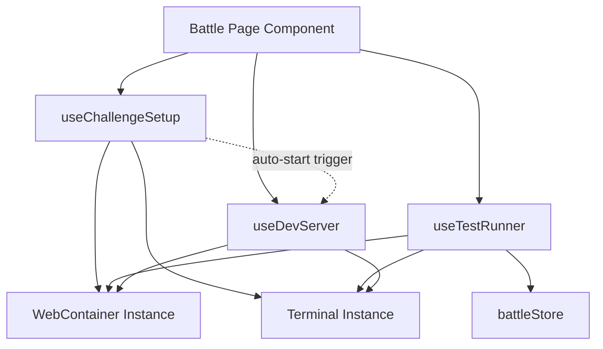

# Refactoring: Code Organization and Reusability Improvements

## Objective

Improve code maintainability, testability, and readability by applying three architectural improvements: separating concerns in the useShell hook, extracting reusable dialog components, and standardizing conditional styling logic.

## Problem Statement

The current codebase exhibits three patterns that reduce maintainability:

1. **useShell Hook Complexity**: The hook manages multiple unrelated responsibilities (challenge setup, test execution, dev server lifecycle, preview state management), making it difficult to test, maintain, and reason about.

2. **Dialog Duplication in FileTree**: Two dialogs (create/rename and delete confirmation) share similar structural patterns but are implemented inline, leading to repetitive code and reduced readability.

3. **Inconsistent Styling Logic**: Conditional class application is handled through mixed approaches (template literals, inline ternaries) rather than leveraging the existing `cn` utility consistently.

## Scope

### In Scope

- Decompose useShell into focused, single-responsibility hooks
- Extract reusable dialog components from FileTree
- Standardize conditional styling using the cn utility
- Maintain all existing functionality and behavior
- Preserve current API contracts for components using these hooks

### Out of Scope

- Changes to business logic or feature behavior
- Modifications to WebContainer API integration patterns
- UI/UX changes or visual redesign
- Performance optimization beyond code organization
- Changes to other hooks or components not mentioned

## Design

### 1. useShell Hook Decomposition

#### Current State Analysis

The useShell hook currently handles:

- Challenge file mounting and cleanup
- Dependency installation
- Test process spawning and output handling
- Dev server lifecycle and port management
- Preview URL state management
- Terminal logging

#### Proposed Architecture

Split useShell into three specialized hooks with clear boundaries:

**Hook: useChallengeSetup**

- **Responsibility**: Challenge initialization and file system preparation
- **Concerns**: File mounting, dependency installation, cleanup
- **State**: None (uses callbacks)
- **Dependencies**: WebContainer instance, Terminal instance

**Hook: useTestRunner**

- **Responsibility**: Test execution and result reporting
- **Concerns**: File synchronization, Vitest process management, output capture
- **State**: Test status, test output buffer
- **Dependencies**: WebContainer instance, Terminal instance, battleStore

**Hook: useDevServer**

- **Responsibility**: Development server lifecycle
- **Concerns**: Server process spawning, port listening, preview URL management
- **State**: Preview URL, iframe refresh key, server listener registration
- **Dependencies**: WebContainer instance, Terminal instance

#### Hook Relationships



#### Interface Contracts

**useChallengeSetup**

| Export           | Type                                      | Description                                               |
| ---------------- | ----------------------------------------- | --------------------------------------------------------- |
| setupChallenge   | `(challenge: Challenge) => Promise<void>` | Mounts files, installs dependencies, prepares environment |
| cleanupChallenge | `() => Promise<void>`                     | Removes challenge files from virtual filesystem           |

**useTestRunner**

| Export     | Type                                                      | Description                                               |
| ---------- | --------------------------------------------------------- | --------------------------------------------------------- |
| runTests   | `(fileContents: Record<string, string>) => Promise<void>` | Syncs files, executes Vitest, captures output             |
| testStatus | `TestStatus`                                              | Current test execution state (idle/running/passed/failed) |
| testOutput | `string`                                                  | Captured test output buffer                               |

**useDevServer**

| Export         | Type                  | Description                                        |
| -------------- | --------------------- | -------------------------------------------------- |
| startServer    | `() => Promise<void>` | Spawns dev server process, registers port listener |
| stopServer     | `() => Promise<void>` | Terminates dev server process                      |
| previewUrl     | `string \| null`      | Internal preview URL from server-ready event       |
| iframeKey      | `number`              | Incremental key for iframe refresh                 |
| refreshPreview | `() => void`          | Triggers iframe reload                             |

#### Interaction Flow

**Challenge Load Sequence**

1. Battle page calls `setupChallenge(challenge)`
2. useChallengeSetup cleans old files, mounts new files, checks dependencies
3. If challenge includes dev script, setupChallenge returns flag
4. Battle page conditionally calls `startServer()` from useDevServer
5. useDevServer registers server-ready listener and spawns process
6. Preview URL updates when server emits ready event

**Test Execution Sequence**

1. User clicks "Run Tests" button
2. Battle page calls `runTests(fileContents)`
3. useTestRunner updates status to RUNNING
4. Files sync to WebContainer filesystem
5. Vitest process spawns, output streams to terminal and buffer
6. Exit code determines final status (PASSED/FAILED)
7. Battle page reads testStatus and testOutput for UI updates

#### Migration Strategy

- Create new hook files in `/hooks` directory
- Extract logic progressively (setup → tests → devServer)
- Keep useShell as facade initially, delegating to new hooks
- Update Battle page imports once all hooks are stable
- Remove useShell facade after migration complete

### 2. Dialog Component Extraction

#### Current State Analysis

FileTree contains two inline dialog implementations:

- Create/Rename Dialog (lines 283-319): Input-based dialog with conditional title/button text
- Delete Confirmation Dialog (lines 322-350): Confirmation dialog with destructive action

Both dialogs share:

- Same DialogContent styling (`bg-zinc-900 border-zinc-800 text-white`)
- DialogHeader with title
- DialogFooter with Cancel + Action buttons
- Similar state management patterns

#### Proposed Components

**Component: FileActionDialog**

- **Purpose**: Reusable input dialog for create/rename operations
- **Flexibility**: Supports dynamic title, placeholder, labels, and submit behavior

**Component: ConfirmationDialog**

- **Purpose**: Reusable confirmation dialog for destructive actions
- **Flexibility**: Supports custom title, message, action button text/variant

#### Component Contracts

**FileActionDialog Props**

| Prop         | Type                      | Required | Description                         |
| ------------ | ------------------------- | -------- | ----------------------------------- |
| open         | `boolean`                 | Yes      | Dialog visibility state             |
| onOpenChange | `(open: boolean) => void` | Yes      | State update callback               |
| mode         | `'create' \| 'rename'`    | Yes      | Dialog mode affecting labels        |
| targetPath   | `string`                  | Yes      | Context path for the action         |
| defaultValue | `string`                  | No       | Pre-filled input value (for rename) |
| onSubmit     | `(value: string) => void` | Yes      | Callback with sanitized input value |

**ConfirmationDialog Props**

| Prop          | Type                         | Required | Description                              |
| ------------- | ---------------------------- | -------- | ---------------------------------------- |
| open          | `boolean`                    | Yes      | Dialog visibility state                  |
| onOpenChange  | `(open: boolean) => void`    | Yes      | State update callback                    |
| title         | `string`                     | Yes      | Dialog header title                      |
| message       | `string \| React.ReactNode`  | Yes      | Confirmation message content             |
| actionLabel   | `string`                     | No       | Confirm button text (default: "Confirm") |
| actionVariant | `'default' \| 'destructive'` | No       | Button variant (default: "destructive")  |
| onConfirm     | `() => void`                 | Yes      | Callback when action confirmed           |

#### Usage Pattern

FileTree component will use the extracted dialogs as follows:

```
State Management:
- createDialogOpen: boolean
- renameDialogOpen: boolean
- deleteDialogOpen: boolean
- dialogContext: { path: string, type: 'file' | 'folder' }

Rendering:
<FileActionDialog
  open={createDialogOpen}
  onOpenChange={setCreateDialogOpen}
  mode="create"
  targetPath={dialogContext.path}
  onSubmit={handleCreate}
/>

<FileActionDialog
  open={renameDialogOpen}
  onOpenChange={setRenameDialogOpen}
  mode="rename"
  targetPath={dialogContext.path}
  defaultValue={extractFilename(dialogContext.path)}
  onSubmit={handleRename}
/>

<ConfirmationDialog
  open={deleteDialogOpen}
  onOpenChange={setDeleteDialogOpen}
  title={`Delete ${dialogContext.type === 'folder' ? 'Folder' : 'File'}?`}
  message={<DeleteMessage path={dialogContext.path} />}
  actionLabel="Delete"
  onConfirm={handleDelete}
/>
```

#### Component Location

Place extracted components in `/components/ui` directory:

- `/components/ui/file-action-dialog.tsx`
- `/components/ui/confirmation-dialog.tsx`

Rationale: These components are generic UI primitives suitable for reuse across the application, following the existing shadcn/ui pattern.

### 3. Conditional Styling Standardization

#### Current State Analysis

Components use mixed approaches for conditional styling:

**Template Literal Pattern** (FileTree line 93-100):

```
className={`
  flex items-center gap-1.5 py-1 px-2 cursor-pointer text-xs select-none transition-colors group
  ${isSelected ? "bg-emerald-900/30 text-emerald-100 border-l-2 border-emerald-500" : "text-zinc-400 hover:text-zinc-100 hover:bg-zinc-800/50"}
`}
```

**Inline Ternary** (BattleHeader line 44-46):

```
className={isRunning ? "opacity-80" : "bg-emerald-600 hover:bg-emerald-700"}
```

The codebase already includes the `cn` utility (`lib/utils.ts`) which combines `clsx` and `tailwind-merge` for optimal class management.

#### Proposed Pattern

Standardize all conditional styling to use the `cn` utility:

**Benefits**:

- Automatic deduplication of conflicting Tailwind classes
- Consistent syntax across codebase
- Better readability with separated concerns
- Type safety for class values

#### Application Examples

**FileTree Node Styling**:
Replace template literal with:

```
className={cn(
  "flex items-center gap-1.5 py-1 px-2 cursor-pointer text-xs select-none transition-colors group",
  isSelected && "bg-emerald-900/30 text-emerald-100 border-l-2 border-emerald-500",
  !isSelected && "text-zinc-400 hover:text-zinc-100 hover:bg-zinc-800/50"
)}
```

**BattleHeader Button Styling**:
Replace inline ternary with:

```
className={cn(
  isRunning && "opacity-80",
  !isRunning && "bg-emerald-600 hover:bg-emerald-700"
)}
```

**When to Extract Helper Functions**:

For complex conditional logic with multiple conditions, extract to helper function:

```
function getNodeClasses(isSelected: boolean, isFolder: boolean) {
  return cn(
    "flex items-center gap-1.5 py-1 px-2 cursor-pointer text-xs",
    "select-none transition-colors group",
    isSelected && "bg-emerald-900/30 text-emerald-100 border-l-2 border-emerald-500",
    !isSelected && "text-zinc-400 hover:text-zinc-100 hover:bg-zinc-800/50",
    isFolder && "font-semibold"
  );
}
```

Helper function criteria:

- More than 3 conditional branches
- Used in multiple locations
- Complex business logic determining classes
- Reusable across components

#### Refactoring Targets

Components requiring styling standardization:

| Component    | File             | Lines  | Current Pattern  | Complexity |
| ------------ | ---------------- | ------ | ---------------- | ---------- |
| FileTreeNode | FileTree.tsx     | 93-100 | Template literal | Medium     |
| BattleHeader | BattleHeader.tsx | 44-46  | Inline ternary   | Low        |

## Implementation Phases

### Phase 1: Hook Decomposition

1. Create useChallengeSetup with file mounting and dependency logic
2. Create useTestRunner with test execution and output capture
3. Create useDevServer with server lifecycle management
4. Update useShell to orchestrate new hooks (facade pattern)
5. Verify all existing functionality preserved

### Phase 2: Dialog Extraction

1. Create FileActionDialog component with mode switching
2. Create ConfirmationDialog component
3. Refactor FileTree to use new dialog components
4. Remove inline dialog implementations
5. Verify dialog interactions unchanged

### Phase 3: Styling Standardization

1. Identify all conditional className patterns
2. Replace template literals with cn utility
3. Replace inline ternaries with cn utility
4. Extract complex styling to helper functions where appropriate
5. Verify visual output unchanged

## Testing Considerations

### Hook Testing Strategy

Each extracted hook should be independently testable:

**useChallengeSetup**:

- Verify file mounting calls WebContainer.mount with correct structure
- Verify dependency installation skips when node_modules populated
- Verify cleanup removes src directory
- Verify terminal logging outputs expected messages

**useTestRunner**:

- Verify file sync writes to WebContainer filesystem
- Verify Vitest process spawns with correct arguments
- Verify output buffer captures all stream data
- Verify status transitions (idle → running → passed/failed)

**useDevServer**:

- Verify server-ready listener registers only once
- Verify preview URL updates when server emits ready event
- Verify refreshPreview increments iframe key
- Verify process spawns with npm run dev command

### Component Testing Strategy

**FileActionDialog**:

- Verify mode prop switches title/labels correctly
- Verify defaultValue pre-fills input
- Verify onSubmit receives trimmed input value
- Verify Enter key submits form
- Verify Cancel button closes dialog

**ConfirmationDialog**:

- Verify title and message render correctly
- Verify actionLabel customizes button text
- Verify actionVariant applies correct button styling
- Verify onConfirm triggers only on action button
- Verify Cancel button closes without calling onConfirm

### Integration Testing

**Battle Page Flow**:

- Verify challenge setup triggers dev server for web challenges
- Verify test execution syncs editor changes before running
- Verify preview URL updates appear in iframe
- Verify dialog actions (create/rename/delete) update file tree

## Success Criteria

- All useShell functionality available through specialized hooks
- No regression in challenge loading, testing, or preview behavior
- FileTree dialogs extracted into reusable components
- All conditional styling uses cn utility consistently
- Test coverage maintained for refactored code
- No changes to user-facing behavior or visual appearance

## Risks and Mitigations

| Risk                                   | Impact | Mitigation                                          |
| -------------------------------------- | ------ | --------------------------------------------------- |
| Hook state synchronization issues      | High   | Maintain single source of truth in battleStore      |
| Dialog extraction breaks edge cases    | Medium | Comprehensive testing of all dialog modes           |
| Styling changes affect visual output   | Low    | Visual regression testing with screenshots          |
| Performance impact from multiple hooks | Low    | Measure render counts, optimize with memo if needed |

## Future Enhancements

- Extract other multi-concern hooks following same pattern
- Create dialog composition utilities for common patterns
- Build styling helper library for domain-specific class logic
- Consider custom hook testing utilities for WebContainer interactions
