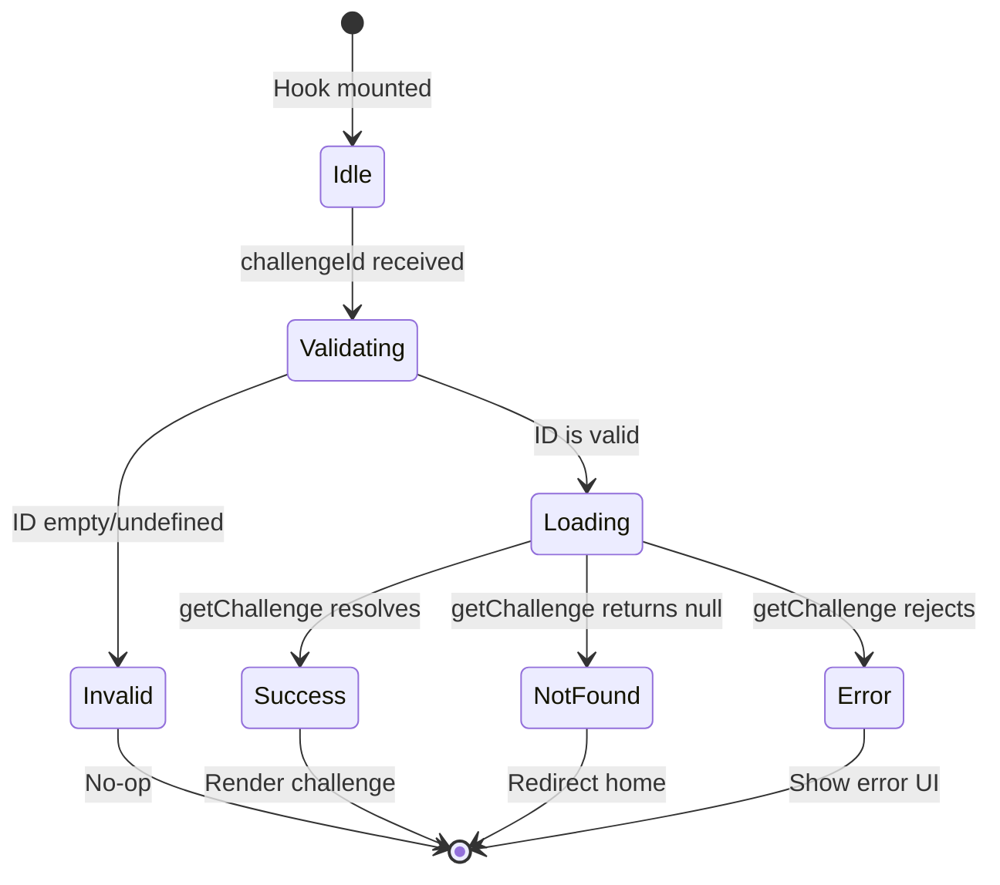

# State Management Refactoring Design

## Overview

This design addresses five critical areas of technical debt in the codebase: state fragmentation in the Battle page, magic numbers scattered throughout components, inconsistent error handling patterns, edge case vulnerabilities in challenge loading, and type safety concerns in file operations.

## Problem Statement

### 1. State Fragmentation in Battle Page

The Battle Arena page manages approximately 10 distinct pieces of state directly within the component, leading to coupling between unrelated concerns and difficulty tracking state relationships.

**Current State Variables:**

- `term`: Terminal instance reference
- `status`: Test execution status (idle/running/passed/failed)
- `testOutput`: Test execution output buffer
- `previewUrl`: Development server URL
- `iframeKey`: Preview iframe cache-busting key
- `monacoInstance`: Monaco editor instance reference
- `isEnvReady`: Dependency installation status flag
- `fileContents`: All file content in the challenge
- `activeFile`: Currently selected file path
- `reviewData`: Code review AI response data
- `bottomTab`: Active bottom panel tab identifier

**Issues:**

- Related state (reviewData, bottomTab, status, testOutput) is managed independently despite representing a cohesive test/review flow
- No clear separation between editor state, execution state, and UI state
- Difficult to reason about which state changes trigger which effects
- Potential for inconsistent state when multiple pieces need to update atomically

### 2. Magic Numbers and Strings

Hardcoded values appear throughout the codebase without semantic meaning or centralized configuration.

**Examples:**

- Debounce timing: 300ms in `useContainerSync`
- Panel sizes: defaultSize={20}, defaultSize={40}, defaultSize={35}, defaultSize={50}
- Dependency check threshold: `dirs.length > 5` to determine if node_modules is populated
- String literals: "console", "tutor" for tab identifiers
- Test status strings: "idle", "running", "passed", "failed"

**Issues:**

- Values lack semantic meaning when encountered in code
- No single source of truth for configuration
- Difficult to maintain consistency across components
- Hard to experiment with different values during development

### 3. Error Handling Consistency

Error handling varies significantly across hooks and components with no unified pattern.

**Current Patterns:**

- Direct console.error in useFileSystem
- Silent error swallowing with empty catch blocks in useShell
- Error state management in useWebContainer
- Fire-and-forget error logging in Battle page (review fetch, cloud save)
- No user-facing error messages for most failure scenarios

**Issues:**

- Users receive no feedback when operations fail silently
- Debugging production issues is difficult without consistent logging
- No error boundary strategy for catastrophic failures
- Logger utility exists but is underutilized

### 4. Challenge Loader Edge Cases

The `useChallengeLoader` hook has several unhandled edge cases that could cause runtime errors or poor user experience.

**Current Issues:**

- No validation that `challengeId` is non-empty before entering effect
- No error handling for promise rejection from `getChallenge`
- No differentiation between "loading", "not found", and "error" states
- Router.push("/") executes even when data is null, causing potential race conditions
- Effect runs on every router instance change, not just challengeId changes

### 5. Type Safety in File Operations

The `useFileSystem` hook uses an unconventional pattern with side effects inside setState callbacks to check for file existence.

**Current Pattern:**

```
let alreadyExists = false;
setFileContents((prev) => {
  if (prev[path]) {
    alreadyExists = true;
    return prev;
  }
  return { ...prev, [path]: "" };
});
if (alreadyExists) return false;
```

**Issues:**

- Mixing side effects (variable mutation) with pure state updates is non-idiomatic
- The pattern is difficult to understand for developers unfamiliar with the codebase
- Unclear execution flow: existence check happens inside state update
- Potential confusion about whether the state update is synchronous or asynchronous

## Solution Design

### 1. Consolidated State Management with Zustand

**Strategy:** Extract related state clusters into focused Zustand stores while keeping component-specific UI state local.

#### 1.1 Battle Execution Store

Create a dedicated store for test execution and review flow state.

**Store Name:** `useBattleStore`
**Location:** `lib/store/battleStore.ts`

**State Schema:**
| Field | Type | Purpose |
|-------|------|---------|
| status | TestStatus | Current execution status (idle, running, passed, failed) |
| testOutput | string | Raw test execution output buffer |
| reviewData | ReviewData or null | AI-generated code review response |
| attemptCount | number | Number of test runs for current challenge |
| activeBottomTab | string | Active tab in bottom panel (console, tutor) |

**Actions:**
| Action | Parameters | Behavior |
|--------|-----------|----------|
| setStatus | status: TestStatus | Updates execution status |
| setTestOutput | output: string | Updates test output buffer |
| setReviewData | data: ReviewData or null | Stores code review result |
| incrementAttempts | none | Increments attempt counter |
| setActiveBottomTab | tab: string | Changes bottom panel tab |
| resetBattle | none | Resets all state to initial values |

**Rationale:**

- Groups state that changes together during test execution flow
- Eliminates prop drilling between BattleHeader, Terminal, and AITutor components
- Provides single source of truth for execution lifecycle
- Enables persistence of attempt count without useRef workarounds

#### 1.2 Editor State Store

Create a store for file editing state that can be shared across editor, file explorer, and preview components.

**Store Name:** `useEditorStore`
**Location:** `lib/store/editorStore.ts`

**State Schema:**
| Field | Type | Purpose |
|-------|------|---------|
| fileContents | Record<string, string> | All file contents in workspace |
| activeFile | string | Currently selected file path |
| monacoInstance | Monaco or null | Monaco editor instance reference |

**Actions:**
| Action | Parameters | Behavior |
|--------|-----------|----------|
| setFileContents | contents: Record<string, string> | Replaces all file contents |
| updateFile | path: string, content: string | Updates single file content |
| setActiveFile | path: string | Changes active file selection |
| setMonacoInstance | monaco: Monaco | Stores Monaco editor instance |
| resetEditor | none | Clears all editor state |

**Rationale:**

- Centralizes file content management
- Makes file contents accessible to preview and sync hooks without prop drilling
- Simplifies file tree rebuilding logic

#### 1.3 Local State Retention

**Keep as Component State:**

- `term`: Terminal instance (specific to Terminal component lifecycle)
- `isEnvReady`: Dependency installation status (specific to setup flow)
- `previewUrl`: Server URL (specific to preview panel)
- `iframeKey`: Cache-busting key (specific to preview panel)

**Rationale:**

- These values are tightly coupled to specific component lifecycles
- Not needed across multiple components
- Moving to global store would add unnecessary complexity

### 2. Constants Configuration Module

**Strategy:** Extract all magic numbers and string literals into typed configuration modules with semantic naming.

**Module Name:** `lib/config/constants.ts`

**Configuration Structure:**

```typescript
// Timing Configuration
export const TIMINGS = {
  DEBOUNCE_FILE_SYNC_MS: 300,
  DEBOUNCE_MONACO_SYNC_MS: 150,
} as const;

// Layout Configuration
export const LAYOUT = {
  SIDEBAR_DEFAULT_SIZE: 20,
  SIDEBAR_MIN_SIZE: 15,
  SIDEBAR_MAX_SIZE: 30,
  EDITOR_DEFAULT_SIZE: 40,
  EDITOR_MIN_SIZE: 25,
  PREVIEW_DEFAULT_SIZE: 35,
  PREVIEW_MIN_SIZE: 20,
  BOTTOM_PANEL_DEFAULT_SIZE: 50,
  BOTTOM_PANEL_MIN_SIZE: 20,
} as const;

// WebContainer Configuration
export const CONTAINER = {
  NODE_MODULES_MIN_DIRS: 5,
  NPM_INSTALL_FLAGS: [
    "install",
    "--prefer-offline",
    "--no-audit",
    "--no-fund",
    "--progress",
  ],
} as const;

// UI Identifiers
export const TABS = {
  CONSOLE: "console",
  TUTOR: "tutor",
} as const;

export const TEST_STATUS = {
  IDLE: "idle",
  RUNNING: "running",
  PASSED: "passed",
  FAILED: "failed",
} as const;

export type TestStatus = (typeof TEST_STATUS)[keyof typeof TEST_STATUS];
```

**Usage Pattern:**

```typescript
// Before
<ResizablePanel defaultSize={20} minSize={15} maxSize={30}>

// After
import { LAYOUT } from "@/lib/config/constants";
<ResizablePanel
  defaultSize={LAYOUT.SIDEBAR_DEFAULT_SIZE}
  minSize={LAYOUT.SIDEBAR_MIN_SIZE}
  maxSize={LAYOUT.SIDEBAR_MAX_SIZE}>
```

**Rationale:**

- Single source of truth for all configuration values
- Type safety with const assertions
- Semantic naming provides context
- Easy to locate and modify values
- Enables runtime configuration in future (e.g., user preferences for panel sizes)

### 3. Unified Error Handling Strategy

**Strategy:** Establish consistent error handling patterns using the existing logger utility and user-facing error states.

#### 3.1 Error Classification

**Categories:**

| Category    | Definition                             | User Impact           | Handling Strategy                      |
| ----------- | -------------------------------------- | --------------------- | -------------------------------------- |
| Critical    | System cannot function                 | Blocks all operations | Error boundary, redirect to error page |
| Recoverable | Operation failed but system functional | Feature unavailable   | Toast notification, fallback UI        |
| Silent      | Background operation failed            | No immediate impact   | Log only, no UI disruption             |

#### 3.2 Error Handling Patterns

**Pattern 1: Critical Errors (WebContainer Initialization)**

Current State: Already well-handled with error boundary UI in Battle page.

Recommendation: Maintain current pattern, extend to other critical failures.

**Pattern 2: Recoverable Errors (File Operations, Challenge Loading)**

Add error state tracking and user notifications.

**Error State Schema:**
| Field | Type | Purpose |
|-------|------|---------|
| type | "error" or "warning" or null | Error severity level |
| message | string | User-friendly error description |
| details | string (optional) | Technical details for debugging |
| timestamp | number | When error occurred |

**Store Name:** `useErrorStore` or extend `useBattleStore`
**Location:** `lib/store/errorStore.ts`

**Actions:**
| Action | Parameters | Behavior |
|--------|-----------|----------|
| setError | type, message, details | Records new error |
| clearError | none | Dismisses current error |

**UI Component:** Toast notification component (shadcn/ui)

**Pattern 3: Silent Errors (Background Sync, Analytics)**

Use logger consistently with appropriate log level.

**Logger Usage Guidelines:**

| Scenario                      | Log Level | Example                                                  |
| ----------------------------- | --------- | -------------------------------------------------------- |
| WebContainer operation failed | error     | logger.error("Failed to write file", { path, error })    |
| Background save failed        | warn      | logger.warn("Cloud save failed", { challengeId, error }) |
| Dependency cache hit          | info      | logger.info("Environment cached, skipping install")      |
| File sync triggered           | debug     | logger.debug("Syncing files to container", { count })    |

#### 3.3 Hook Error Handling Updates

**useFileSystem:**

Transform:

```typescript
// Current
catch (e) {
  console.error("Failed to create file in container", e);
}

// Updated
catch (error) {
  logger.error("Failed to create file in container", { path, error });
  errorStore.setError("error", `Unable to create file: ${path}`, error.message);
  return false;
}
```

**useChallengeLoader:**

Add error state and proper promise handling (detailed in section 4).

**useShell:**

Replace empty catch blocks with proper error logging:

```typescript
// Current
try {
  await instance.fs.rm("src", { recursive: true, force: true });
} catch {
  // Directory may not exist on first load, ignore error
}

// Updated
try {
  await instance.fs.rm("src", { recursive: true, force: true });
} catch (error) {
  // Expected: directory may not exist on first challenge load
  logger.debug("No existing src directory to remove", { error });
}
```

### 4. Enhanced Challenge Loader with Edge Case Handling

**Strategy:** Add comprehensive validation, error states, and proper loading lifecycle management.

#### 4.1 Enhanced State Schema

**Current State:**

- challenge: Challenge or null
- isLoading: boolean

**Enhanced State:**
| Field | Type | Purpose |
|-------|------|---------|
| challenge | Challenge or null | Loaded challenge data |
| isLoading | boolean | Initial load in progress |
| error | Error or null | Load failure details |
| notFound | boolean | Challenge ID does not exist |

#### 4.2 Loading State Transitions

**State Machine:**



#### 4.3 Validation Logic

**Input Validation:**

- Check challengeId is truthy string before executing effect
- Trim whitespace to catch edge cases
- Validate format if IDs follow specific pattern (optional)

**Effect Dependency Management:**

- Only depend on challengeId, not router instance
- Use stable router reference or eliminate redirect from hook

#### 4.4 Promise Error Handling

**Current Pattern:**

```typescript
getChallenge(challengeId).then((data) => {
  setChallenge(data);
  setIsLoading(false);
  if (!data) {
    router.push("/");
  }
});
```

**Enhanced Pattern:**

```typescript
getChallenge(challengeId)
  .then((data) => {
    if (!data) {
      setNotFound(true);
      setChallenge(null);
    } else {
      setChallenge(data);
      setNotFound(false);
    }
    setError(null);
  })
  .catch((error) => {
    logger.error("Failed to load challenge", { challengeId, error });
    setError(error);
    setChallenge(null);
  })
  .finally(() => {
    setIsLoading(false);
  });
```

#### 4.5 Return Value Enhancement

**Current Return:**

```typescript
{
  challenge, isLoading;
}
```

**Enhanced Return:**

```typescript
{
  challenge,
  isLoading,
  error,
  notFound,
  retry: () => void // Function to retry load
}
```

### 5. Type-Safe File Operations Refactoring

**Strategy:** Refactor existence checks to use clearer, more conventional patterns while maintaining closure safety.

#### 5.1 Current Pattern Analysis

**Problem:** Side effect (variable mutation) inside setState callback violates React best practices and functional programming principles.

**Why It Works:** The functional update form guarantees access to current state, avoiding stale closure issues.

**Why It's Problematic:** Difficult to understand, hard to test, unconventional pattern.

#### 5.2 Refactored Pattern: Separate Existence Check

**Approach:** Perform existence check synchronously before state update using current snapshot.

**Pattern:**

```typescript
const createFile = useCallback(
  async (path: string): Promise<{ success: boolean; reason?: string }> => {
    // 1. Check existence synchronously using current state snapshot
    const currentFiles = fileContents;
    if (currentFiles[path]) {
      return { success: false, reason: "File already exists" };
    }

    // 2. Update React state
    setFileContents((prev) => ({
      ...prev,
      [path]: "",
    }));

    // 3. Update WebContainer filesystem
    if (instance) {
      try {
        await instance.fs.writeFile(path, "");
      } catch (error) {
        logger.error("Failed to create file in container", { path, error });
        // Rollback React state on failure
        setFileContents((prev) => {
          const { [path]: removed, ...rest } = prev;
          return rest;
        });
        return { success: false, reason: "Filesystem error" };
      }
    }

    return { success: true };
  },
  [fileContents, setFileContents, instance]
);
```

**Trade-offs:**

| Aspect         | Current Pattern                     | Refactored Pattern               |
| -------------- | ----------------------------------- | -------------------------------- |
| Closure Safety | ✅ Guaranteed via functional update | ⚠️ Requires fileContents in deps |
| Clarity        | ❌ Unconventional, hard to read     | ✅ Sequential, clear flow        |
| Error Handling | ❌ No rollback on failure           | ✅ Rollback on filesystem error  |
| Return Value   | boolean                             | Rich result object               |
| Testability    | ❌ Difficult to test side effects   | ✅ Clear inputs/outputs          |

#### 5.3 Alternative: Store-Based Approach

If fileContents moves to `useEditorStore` (recommended in section 1.2), this problem disappears entirely.

**Store-Based Pattern:**

```typescript
// In useEditorStore
createFile: (path: string) => {
  const { fileContents } = get();
  if (fileContents[path]) {
    return { success: false, reason: "File already exists" };
  }
  set({
    fileContents: { ...fileContents, [path]: "" },
  });
  return { success: true };
};

// In useFileSystem hook
const createFile = useCallback(
  async (path: string) => {
    const result = editorStore.createFile(path);
    if (!result.success) {
      return result;
    }

    // Sync to WebContainer
    if (instance) {
      try {
        await instance.fs.writeFile(path, "");
      } catch (error) {
        // Rollback store state
        editorStore.deleteFile(path);
        return { success: false, reason: "Filesystem error" };
      }
    }
    return { success: true };
  },
  [instance]
);
```

**Rationale:**

- Eliminates closure issues entirely
- Store provides synchronous access to current state
- Cleaner separation between state management and side effects
- Easier to test and reason about

## Implementation Strategy

### Phase 1: Foundation (Low Risk)

**Goal:** Establish infrastructure without breaking existing functionality.

**Tasks:**

1. Create constants module with all magic numbers/strings
2. Set up error store infrastructure
3. Enhance logger usage in existing hooks
4. Add input validation to useChallengeLoader

**Validation:** Existing functionality unchanged, new infrastructure unused but available.

### Phase 2: State Migration (Medium Risk)

**Goal:** Migrate state to Zustand stores incrementally.

**Tasks:**

1. Create useBattleStore with execution state
2. Update Battle page to use battleStore for status/testOutput/reviewData
3. Create useEditorStore with file state
4. Migrate fileContents and activeFile to editorStore
5. Update all components consuming these values

**Validation:** Run all challenges end-to-end, verify state updates correctly.

### Phase 3: Refinement (Low Risk)

**Goal:** Apply refactored patterns and cleanup.

**Tasks:**

1. Refactor useFileSystem with new pattern (store-based or separate check)
2. Replace magic numbers with constants throughout codebase
3. Add error handling UI (toast notifications)
4. Implement retry logic in challenge loader

**Validation:** Test error scenarios (network failures, invalid IDs, file conflicts).

### Phase 4: Optimization (Optional)

**Goal:** Performance and developer experience improvements.

**Tasks:**

1. Add state persistence for editor and battle stores (localStorage)
2. Implement state selectors for performance
3. Add DevTools integration for Zustand stores
4. Document state management patterns in AGENTS.MD

## Success Criteria

| Criterion                   | Measurement                                             |
| --------------------------- | ------------------------------------------------------- |
| State Consolidation         | Battle page component has ≤5 local state variables      |
| Magic Numbers Eliminated    | Zero hardcoded numbers/strings outside constants module |
| Error Handling Coverage     | All async operations have try/catch with logging        |
| Challenge Loader Robustness | Handles all edge cases (empty ID, errors, not found)    |
| File Operations Clarity     | No side effects in setState callbacks                   |
| Type Safety                 | All stores and operations fully typed with no `any`     |
| User Feedback               | Errors surface user-friendly messages via UI            |

## Risk Assessment

| Risk                                  | Likelihood | Impact | Mitigation                                      |
| ------------------------------------- | ---------- | ------ | ----------------------------------------------- |
| State migration breaks existing flows | Medium     | High   | Incremental migration, comprehensive testing    |
| Constants module becomes too large    | Low        | Low    | Split into domain-specific modules if needed    |
| Store dependencies create coupling    | Medium     | Medium | Design stores around bounded contexts           |
| Error toast spam overwhelms UI        | Low        | Medium | Implement error deduplication and rate limiting |

## Future Considerations

### Potential Enhancements

1. **State Persistence**: Persist editor and battle state to localStorage for session recovery
2. **Undo/Redo**: Leverage Zustand middleware for editor history
3. **Optimistic Updates**: Update UI immediately, rollback on failure
4. **State Devtools**: Integrate Redux DevTools for debugging
5. **State Snapshots**: Capture state for bug reports and error recovery

### Scalability

As the platform grows, consider:

- Splitting stores by domain (challenges, user, editor, execution)
- Implementing state normalization for relational data
- Adding state migration strategies for schema changes
- Using immer middleware for immutable updates

## Non-Goals

This refactoring explicitly does NOT include:

- Backend state management or API caching
- Real-time collaboration features
- State synchronization across browser tabs
- Migration to other state libraries (Redux, Jotai, etc.)
