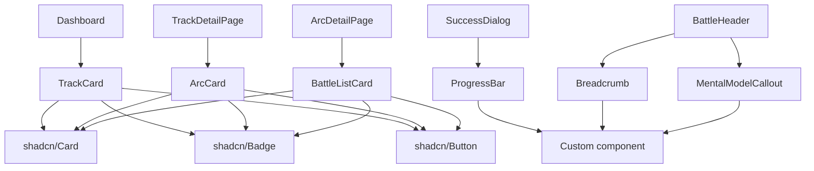

# Track UI Components Design

## Overview

This document defines the UI components needed to expose the Track → Arc → Battle hierarchy to users. The design follows the existing dark-mode IDE aesthetic and uses shadcn/ui components.

---

## Component Architecture

```
Dashboard (/)
  └─> TrackCard (multiple)
       └─> Click → TrackDetailPage (/track/[trackId])
            └─> ArcCard (multiple)
                 └─> Click → ArcDetailPage (/track/[trackId]/arc/[arcId])
                      └─> BattleCard (multiple)
                           └─> Click → Battle Arena (/battle/[id])
                                └─> BattleHeader (updated)
                                └─> SuccessDialog (updated)
```

---

## 1. TrackCard Component

### Purpose
Display a track with its progress, primary skill, and entry point.

### Location
`/components/tracks/TrackCard.tsx`

### Props
```typescript
interface TrackCardProps {
  track: Track;
  progress: {
    completedBattles: number;
    totalBattles: number;
    currentArcId?: string;
  };
  isActive: boolean; // Is this track available to the user?
}
```

### Visual Design

```
┌────────────────────────────────────────────────────────┐
│ 🎯 Frontend Debugging                       [ACTIVE]   │
│                                                        │
│ Master the art of debugging user interfaces,          │
│ state management, and browser-based applications.     │
│                                                        │
│ Primary Skill: Debugging UI & stateful systems        │
│ Execution: Code-based with preview                    │
│                                                        │
│ ┌──────────────────────────────────────────────────┐  │
│ │ ████████████░░░░░░░░░░░░░░░░░░░░  40% (6/15)    │  │
│ └──────────────────────────────────────────────────┘  │
│                                                        │
│ Current Arc: State & Mutations                         │
│                                                        │
│ [Continue Learning →]                   [COMING SOON]  │
└────────────────────────────────────────────────────────┘
```

### Styling Notes
- Use existing `Card` component from shadcn
- Background: `bg-zinc-900/50 border-zinc-800`
- Hover: `hover:border-emerald-700 transition-all`
- Active badge: emerald-500
- Inactive tracks: "Coming Soon" badge (yellow-500), clickable but shows info modal

### Behavior
- Click entire card → Navigate to `/track/{trackId}` (all tracks)
- Inactive tracks show "Coming Soon" badge
- Clicking inactive track shows modal: "This track is coming soon! Currently available: Frontend Debugging"
- Hover shows subtle glow effect on all cards

---

## 2. TrackDetailPage

### Purpose
Show all arcs within a track with their mental models and progress.

### Location
`/app/track/[trackId]/page.tsx`

### Data Requirements
```typescript
interface TrackDetailData {
  track: Track;
  arcs: Arc[];
  battlesByArc: Map<string, Battle[]>;
  userProgress: Map<string, number>; // arcId → completed count
}
```

### Visual Design

```
┌─────────────────────────────────────────────────────────┐
│ ← Back to Tracks                                        │
│                                                         │
│ Frontend Debugging Track                                │
│ Master debugging UI & stateful systems                  │
│                                                         │
│ Progress: 6/15 battles completed (40%)                  │
│ ████████████░░░░░░░░░░░░░░░░░░░░                       │
└─────────────────────────────────────────────────────────┘

┌─────────────────────────────────────────────────────────┐
│ Arc 1: Foundations — Reading the Bug              ✓    │
│                                                         │
│ 💡 "Disciplined observation before editing.            │
│     Understanding what the code does vs what it         │
│     should do."                                         │
│                                                         │
│ 3/3 battles completed                                   │
│ ████████████████████████████████████████████  100%     │
│                                                         │
│ [Review Battles →]                                      │
└─────────────────────────────────────────────────────────┘

┌─────────────────────────────────────────────────────────┐
│ Arc 2: State & Mutations                          ⚡    │
│                                                         │
│ 💡 "State is immutable. Direct mutations break         │
│     React's update detection."                          │
│                                                         │
│ 1/3 battles completed                                   │
│ ████████████░░░░░░░░░░░░░░░░░░░░░░░░░░░░░░░  33%      │
│                                                         │
│ [Continue Arc →]                                        │
└─────────────────────────────────────────────────────────┘

┌─────────────────────────────────────────────────────────┐
│ Arc 3: Effects & Closures                               │
│                                                         │
│ 💡 "Effects capture values at render time.             │
│     Dependency arrays control when effects run."        │
│                                                         │
│ 0/4 battles                                             │
│ ░░░░░░░░░░░░░░░░░░░░░░░░░░░░░░░░░░░░░░░░░░░  0%        │
│                                                         │
│ [Explore Arc →]                                         │
└─────────────────────────────────────────────────────────┘
```

### Components Used
- Header with breadcrumb
- Track progress bar
- `ArcCard` component (see below)

---

## 3. ArcCard Component

### Purpose
Display an arc with its mental model, progress, and entry point.

### Location
`/components/tracks/ArcCard.tsx`

### Props
```typescript
interface ArcCardProps {
  arc: Arc;
  trackId: string;
  progress: {
    completed: number;
    total: number;
  };
  status: 'locked' | 'active' | 'completed';
  lockReason?: string; // e.g., "Complete Arc 1 to unlock"
}
```

### States
1. **Completed** (✓) - All battles done, green border
2. **Active** (⚡) - In progress, emerald accent
3. **Available** - Default state, ready to start (no lock needed)

### Styling
- Completed: `border-emerald-900/50`, green checkmark icon
- Active: `border-emerald-700`, lightning icon, glow effect
- Available: `border-zinc-800`, default hover state

---

## 4. ArcDetailPage (Battle List)

### Purpose
Show all battles within an arc with clear progression.

### Location
`/app/track/[trackId]/arc/[arcId]/page.tsx`

### Visual Design

```
┌─────────────────────────────────────────────────────────┐
│ ← State & Mutations Arc                                 │
│                                                         │
│ Frontend Debugging > State & Mutations                  │
│                                                         │
│ 💡 Mental Model:                                        │
│ "State is immutable. Direct mutations break React's    │
│  update detection."                                     │
│                                                         │
│ Progress: 1/3 battles completed (33%)                   │
│ ████████████░░░░░░░░░░░░░░░░░░░░░░░░░░░░░░░            │
└─────────────────────────────────────────────────────────┘

┌─────────────────────────────────────────────────────────┐
│ 1. Shopping Cart Bug                              ✓    │
│                                                         │
│    [Easy] React • TypeScript • Vite                     │
│                                                         │
│    Cart total doesn't update when items are removed.   │
│    Fix the state mutation bug.                          │
│                                                         │
│    Completed: Dec 14, 2025                              │
│                                                         │
│    [Replay Challenge →]                                 │
└─────────────────────────────────────────────────────────┘

┌─────────────────────────────────────────────────────────┐
│ 2. Todo List Mutation                             ⚡    │
│                                                         │
│    [Easy] React • TypeScript • Vite                     │
│                                                         │
│    Adding todos doesn't update the UI. Spot the        │
│    direct mutation in the component.                    │
│                                                         │
│    [Start Debugging →]                                  │
└─────────────────────────────────────────────────────────┘

┌─────────────────────────────────────────────────────────┐
│ 3. Mutation + Memoization                               │
│                                                         │
│    [Hard] React • TypeScript • Performance              │
│                                                         │
│    useMemo returns stale values. Learn how mutation    │
│    breaks React's optimization strategies.              │
│                                                         │
│    [Start Debugging →]                                  │
└─────────────────────────────────────────────────────────┘
```

### Components
- Arc header with mental model callout
- `BattleListCard` component for each battle
- Sequential unlock indicators

---

## 5. BattleListCard Component

### Purpose
Show battle preview in arc list with status.

### Location
`/components/tracks/BattleListCard.tsx`

### Props
```typescript
interface BattleListCardProps {
  battle: Battle;
  arcId: string;
  trackId: string;
  order: number;
  status: 'completed' | 'available';
  completedAt?: Date;
}
```

### Styling
- Completed: Green border, checkmark, "Replay" button
- Available: Default, "Start Debugging" button, glow on hover

---

## 6. Updated BattleHeader Component

### Current Location
`/components/arena/BattleHeader.tsx`

### New Props (Added)
```typescript
interface BattleHeaderProps {
  // Existing props
  title: string;
  difficulty: Difficulty;
  
  // NEW: Track/Arc context
  trackId: string;
  arcId: string;
  arcTitle?: string;
  arcMentalModel?: string;
  battleOrder?: number;
  totalBattlesInArc?: number;
}
```

### Visual Design (Updated)

```
┌─────────────────────────────────────────────────────────┐
│ Frontend Debugging > State & Mutations > Shopping Cart  │
│                                                         │
│ Shopping Cart Bug                             [Medium] │
│                                                         │
│ 💡 Remember: State is immutable. Mutations break       │
│              React's update detection.                  │
│                                                         │
│ Battle 1 of 3 in this arc                              │
│                                                         │
│ [Run Tests] [Reset Code] [Ask AI Tutor]               │
└─────────────────────────────────────────────────────────┘
```

### New Elements
1. **Breadcrumb navigation** - Links back to track/arc pages
2. **Mental model reminder** - Arc's core concept in light callout box
3. **Progress indicator** - "Battle X of Y in this arc"

---

## 7. Updated SuccessDialog Component

### Current Location
`/components/arena/SuccessDialog.tsx`

### New Props (Added)
```typescript
interface SuccessDialogProps {
  // Existing props
  isOpen: boolean;
  onClose: () => void;
  
  // NEW: Navigation context
  currentBattleId: string;
  nextBattleInArc?: {
    id: string;
    title: string;
    difficulty: Difficulty;
  };
  nextArc?: {
    id: string;
    title: string;
    firstBattleId: string;
  };
  arcProgress: {
    completed: number;
    total: number;
    arcName: string;
  };
}
```

### Visual Design (Updated)

```
┌─────────────────────────────────────────────────────────┐
│                    🎉 Battle Complete!                   │
│                                                         │
│ You've mastered the Shopping Cart Bug                  │
│                                                         │
│ ┌───────────────────────────────────────────────────┐  │
│ │ Arc Progress: State & Mutations                   │  │
│ │ ████████████░░░░░░░░░░░░░░░░░░░░░  2/3 battles   │  │
│ └───────────────────────────────────────────────────┘  │
│                                                         │
│ What's Next?                                            │
│                                                         │
│ ┌───────────────────────────────────────────────────┐  │
│ │ → Todo List Mutation [Easy]                       │  │
│ │   Continue mastering state mutations              │  │
│ │                                                   │  │
│ │   [Next Battle →]                                 │  │
│ └───────────────────────────────────────────────────┘  │
│                                                         │
│ Or explore:                                             │
│ • Effects & Closures Arc                                │
│ • Review current arc battles                            │
│ • Back to State & Mutations arc                         │
│                                                         │
│ [Close] [View Code Review]                             │
└─────────────────────────────────────────────────────────┘
```

### Special Cases

**Arc Completed:**
```
┌─────────────────────────────────────────────────────────┐
│              🏆 Arc Mastered!                           │
│                                                         │
│ You've completed State & Mutations!                    │
│                                                         │
│ ✓ Shopping Cart Bug                                    │
│ ✓ Todo List Mutation                                   │
│ ✓ Mutation + Memoization                               │
│                                                         │
│ Key Takeaway:                                           │
│ "State is immutable. Direct mutations break React's    │
│  update detection."                                     │
│                                                         │
│ Ready for the next challenge?                           │
│                                                         │
│ ┌───────────────────────────────────────────────────┐  │
│ │ → Effects & Closures Arc                          │  │
│ │   "Effects capture values at render time"         │  │
│ │                                                   │  │
│ │   [Start Arc →]                                   │  │
│ └───────────────────────────────────────────────────┘  │
└─────────────────────────────────────────────────────────┘
```

---

## 8. Supporting Components

### ProgressBar Component
**Location:** `/components/ui/progress-bar.tsx`

```typescript
interface ProgressBarProps {
  current: number;
  total: number;
  variant?: 'default' | 'success' | 'warning';
  showLabel?: boolean;
}
```

Visual:
```
████████████░░░░░░░░░░░░░░░░░░░░  40% (6/15)
```

### Breadcrumb Component
**Location:** `/components/ui/breadcrumb.tsx`

```typescript
interface BreadcrumbProps {
  items: Array<{
    label: string;
    href?: string;
  }>;
}
```

Visual:
```
Frontend Debugging > State & Mutations > Shopping Cart Bug
```

### StatusBadge Component
**Location:** Reuse existing `Badge` from shadcn

Variants:
- `completed` → Green with checkmark
- `active` → Emerald with lightning
- `locked` → Gray with lock icon

---

## Data Fetching Strategy

### Helper Functions Needed

```typescript
// /lib/content/progress.ts

export async function getTrackProgress(
  trackId: string, 
  userId: string
): Promise<TrackProgress> {
  const battles = await getBattlesByTrack(trackId);
  const solved = await getUserSolvedBattles(userId);
  // Calculate progress
}

export async function getArcProgress(
  arcId: string, 
  userId: string
): Promise<ArcProgress> {
  const battles = await getBattlesByArc(arcId);
  const solved = await getUserSolvedBattles(userId);
  // Calculate progress
}

export async function getNextBattle(
  currentBattleId: string
): Promise<NextBattleInfo | null> {
  const next = getNextBattleInArc(currentBattleId);
  if (next) return next;
  return getNextArcFirstBattle(currentBattleId);
}
```

---

## Routing Structure

```
/                           → Dashboard with TrackCards
/track/[trackId]            → Track detail with ArcCards
/track/[trackId]/arc/[arcId] → Arc detail with BattleCards
/battle/[id]                → Battle arena (existing)
```

---

## Component Dependencies



---

## Design Principles

1. **Reuse shadcn components** - Don't reinvent the wheel
2. **Consistent dark theme** - Match existing IDE aesthetic
3. **Clear visual hierarchy** - Track → Arc → Battle
4. **Progressive disclosure** - Show context without overwhelming
5. **Accessible navigation** - Breadcrumbs, back buttons, clear CTAs
6. **Celebrate progress** - Visual feedback on completion

---

## Color Palette

```
Primary Background:     #09090b (zinc-950)
Card Background:        #18181b (zinc-900/50)
Border Default:         #27272a (zinc-800)
Border Hover:           #3f3f46 (zinc-700)

Accent (Active):        #10b981 (emerald-500)
Accent Border:          #047857 (emerald-700)
Success:                #22c55e (green-500)
Warning:                #eab308 (yellow-500)

Text Primary:           #fafafa (white)
Text Secondary:         #a1a1aa (zinc-400)
Text Muted:             #71717a (zinc-500)
```

---

## Accessibility Notes

- All navigation links must have proper ARIA labels
- Progress bars need `aria-valuenow`, `aria-valuemin`, `aria-valuemax`
- Locked states need `aria-disabled="true"` and explanation
- Success celebrations need `role="alert"` for screen readers
- Breadcrumbs need proper semantic `nav` structure

---

## Mobile Responsiveness

- TrackCards: Stack vertically on mobile
- ArcCards: Full width on mobile, add bottom margin
- BattleListCards: Simplify layout, hide secondary info
- Breadcrumbs: Collapse to "Back" button on small screens
- Progress bars: Maintain on mobile with smaller text

---

## Implementation Priority

### Phase 1 (MVP - Make tracks visible)
1. ✅ Update Dashboard to show TrackCards
2. ✅ Create TrackDetailPage with ArcCards
3. ✅ Update BattleHeader with breadcrumbs
4. ✅ Update SuccessDialog with next battle logic

### Phase 2 (Enhanced UX)
5. ⏳ Create ArcDetailPage with BattleListCards
6. ⏳ Add sequential unlock logic
7. ⏳ Implement arc completion celebration

### Phase 3 (Polish)
8. ⏳ Add animations and transitions
9. ⏳ Implement cross-track pattern hints
10. ⏳ Build progress dashboard

---

## Design Decisions (Approved)

1. **Lock Strategy:** ✅ **FREE EXPLORATION** - Users can access any arc/battle in any order
2. **Track Access:** ✅ **SHOW ALL TRACKS** - All 7 tracks visible with "Coming Soon" badge for inactive ones
3. **Battle List Page:** ✅ **INCLUDE ARC DETAIL PAGE** - `/track/[trackId]/arc/[arcId]` with battle list
4. **Navigation:** ✅ **MANUAL NAVIGATION** - Success dialog has "Next Battle" button, no auto-redirect
5. **Progress Persistence:** ⏳ Continue using localStorage (Supabase migration later)

---

## Next Steps

Once this design is approved:
1. Implement ProgressBar and Breadcrumb utility components
2. Create TrackCard component
3. Update Dashboard to use TrackCards
4. Create TrackDetailPage with ArcCards
5. Update BattleHeader and SuccessDialog
6. Test navigation flow end-to-end
